# Advanced Shaders

A WebGPU/WGSL playground for studying advanced real-time shading techniques.
Each study is a self-contained "demo" registered in a shared scene shell
(sidebar navigation, orbit camera, parameter GUI, HDR pipeline).

| # | Study | Techniques |
|---|-------|-----------|
| 01 | [Deep-water ocean](src/demos/ocean) | compute-shader FFT, vertex displacement, procedural animation, BRDFs, screen-space refraction, caustics, GPU buoyancy |
| 02 | [Volumetric clouds](src/demos/clouds) | ray marching, tileable 3D noise, density shaping, multiple scattering, weather maps, temporal reprojection |
| 03 | [Watercolour](src/demos/watercolour) | G-buffer stylisation, lighting abstraction, world-space brush direction, edge extraction, colour bleeding, paper, temporal coherence |
| 04 | [Portals](src/demos/portals) | recursive stencil portals, oblique near-plane clipping, objects crossing the plane, camera teleport, boundary distortion |
| 05 | [SDF world](src/demos/sdf) | one fullscreen fragment shader: smooth CSG, repetition, deformation, domain warping, soft shadows, AO, reflections |
| 06 | [Black hole](src/demos/blackhole) | Schwarzschild null geodesics (RK4 / Dormand–Prince), accretion disk with Doppler + gravitational redshift, lensed starfield, ray differentials |
| 07 | [Magical materials](src/demos/magic) | one procedural field drives interior energy, cracks, refraction, Fresnel glow, SSS-like transmission, distortion and GPU particles |
| 08 | [Atmospheric scattering](src/demos/atmosphere) | Hillaire 2020 LUTs: transmittance, multiple scattering, sky-view, aerial-perspective froxels; brute-force reference with error meter |
| 09 | [Procedural planet](src/demos/planet) | textureless Earth: layered noise on the sphere, biomes, ocean, clouds, city lights, shared atmosphere, orbit-to-ground LOD |

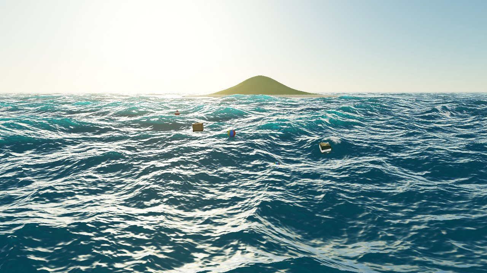
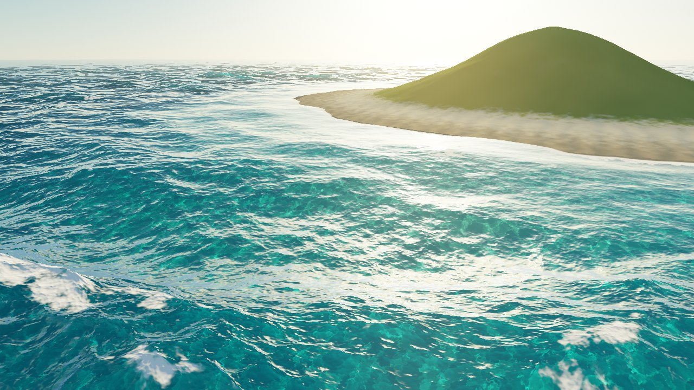
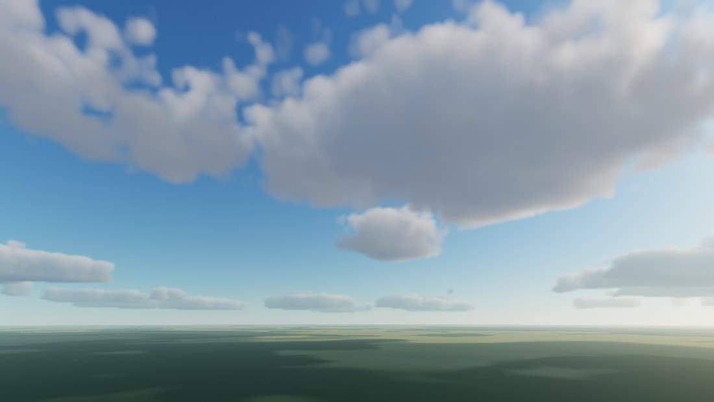
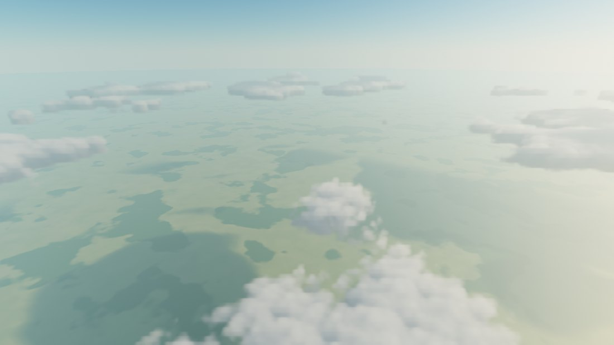
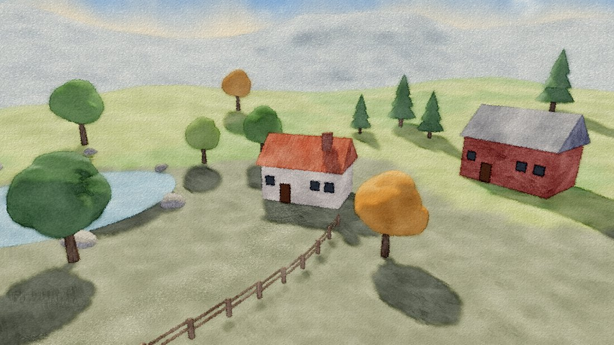
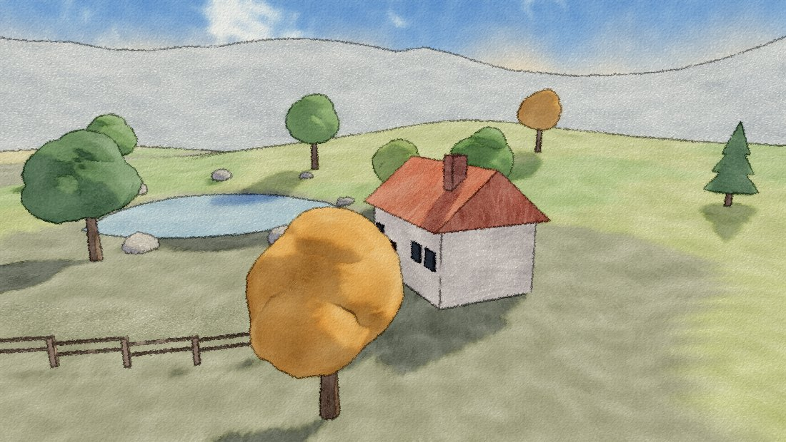

## Videos

60 fps, 1280×720 captures of each study (H.264):

- [`docs/videos/ocean.mp4`](docs/videos/ocean.mp4): open water and sun glitter,
  shoreline with caustics and breaking waves, dropped objects splashing, storm.
- [`docs/videos/clouds.mp4`](docs/videos/clouds.mp4): time-lapse cumulus, a
  climb through the cloud layer, sunset into the sun, overcast clearing up.
- [`docs/videos/watercolour.mp4`](docs/videos/watercolour.mp4): an orbit around
  the cottage, a pen-and-wash dolly-in, wet-in-wet under a low sun.

They are rendered offline, one fixed 1/60 s step per frame, so they are smooth
regardless of how fast the machine renders. To re-record (for example after
changing a shader or `tools/shots.mjs`):

```sh
npm i -D playwright            # the recorder drives Chromium through Playwright
npm run dev                    # keep running in another terminal
node tools/record.mjs all      # or: ocean | clouds
```

It needs `ffmpeg` with libx264 on `PATH` (or `FFMPEG=/path/to/ffmpeg`). Useful
flags: `--size 1920x1080`, `--fps 120`, `--crf 18`, `--headed` (some platforms
only expose the GPU to a visible browser), `--swiftshader` for machines
without a GPU, and `--final-crf 26` to re-encode the joined file smaller (the
committed ocean video uses it). Each shot is cached as a segment in `docs/videos/.segments`, so
an interrupted run resumes where it stopped. With a real GPU a full run takes
minutes. The committed videos were rendered on SwiftShader (CPU), at about
7 s per ocean frame and 1 s per clouds frame.

## Running

```sh
npm install
npm run dev        # http://localhost:5173
npm run build      # type-check + production bundle in dist/
```

It needs a browser with WebGPU: Chrome/Edge 113+, Safari 26+, or Firefox with
WebGPU enabled. `?scale=0.5` renders at half resolution on slow GPUs.

Controls: drag to orbit, right-drag to pan, wheel to zoom, `WASD` to move,
`Q`/`E` to go down/up, and `Shift`+drag on the water to move a floating object.
The active demo is exposed as `window.demo` in the devtools console.

## Layout

```
src/
  main.ts              scene shell: WebGPU init, routing (#/<id>), render loop, HUD
  core/                camera, math, GPU helpers, Demo interface, registry
  shared/              analytic sky (WGSL + CPU mirror) used by every study
  demos/ocean/         01 · deep-water ocean
    index.ts           resources and frame graph
    params.ts          defaults, presets, GUI
    shaders/*.wgsl
  demos/clouds/        02 · volumetric clouds (same structure)
```

To add a study, implement `DemoEntry` from `src/core/demo.ts` and append it to
`src/core/registry.ts`.

## 01 · Deep-water ocean

### Frame graph

```
compute  spectrum_init + spectrum_conjugate   (only when spectrum parameters change)
compute  spectrum_update      h(k,t) → 8 packed complex fields × 3 cascades
compute  fft (rows) → fft (columns)            256-point IFFT in workgroup memory
compute  assemble             displacement, derivatives, Jacobian foam (ping-pong)
compute  mipgen               mip chains for displacement / derivatives
compute  ripples ×2           wave equation, driven by floating bodies
compute  buoyancy             rigid bodies sample the water, write model matrices
render   caustics             photon-area caustic texture (additive)
render   scene                sky, island/seabed, floating objects → HDR + distance
copy     HDR → scene copy     input for refraction
render   ocean                clipmap surface, full water shading
render   composite            exposure, ACES, sRGB
```

### Techniques and where they live

- **FFT waves** (`spectrum_*.wgsl`, `fft.wgsl`, `assemble.wgsl`): JONSWAP
  spectrum with finite-depth dispersion, Donelan/Hasselmann-style directional
  spreading plus swell, short-wave suppression. Three cascades (250 m, 34 m,
  7.3 m) with non-overlapping wavenumber bands. The time update packs Dx+iDz,
  Dy+i∂Dz/∂x, ∂Dy/∂x+i∂Dy/∂z and ∂Dx/∂x+i∂Dz/∂z, so 8 real fields cost 4
  complex IFFTs. The IFFT runs one 256-invocation workgroup per line with a
  bit-reversed load and 8 radix-2 stages in shared memory.
- **Vertex displacement** (`ocean.wgsl` `vs`, `waves.wgsl`): a camera-centred
  geometry clipmap of 10 levels (129² vertices each, spacing doubling per
  level). Levels snap to twice their spacing. Odd vertices morph onto even ones
  near each level's outer edge, and the displacement mip is matched across the
  seam, so levels meet without cracks. The fragment shader discards each
  level's inner hole.
- **Multi-scale normals**: slopes from all cascades are summed and divided by
  the horizontal-displacement Jacobian terms. Mip-mapped, anisotropically
  filtered derivative textures handle distance, and roughness rises with
  distance to keep the sun highlight energy.
- **Fresnel reflection**: Schlick (F0 = 0.02) blending between the analytic sky
  (Rayleigh + Mie single scattering, `sky.wgsl`) and the refracted water.
- **Sun glitter**: GGX with height-correlated Smith visibility, plus sparse
  sharp micro-facet glints that re-randomise over time.
- **Refraction and depth colour**: the scene is rendered first with a linear
  distance target. The water pass offsets the lookup by the normal, rejects
  samples in front of the surface, and applies Beer–Lambert absorption per
  channel over the refracted path length, plus in-scattering from the water body.
- **Subsurface scattering**: the wave-crest back-lit term and view term from
  the Atlas GDC 2019 talk.
- **Foam**: Jacobian-driven whitecaps that accumulate and decay in the
  simulation, breaking foam from shoreline waves, contact foam where the water
  gets thin against geometry (screen-space depth difference), and ripple
  foam, all masked by an animated noise pattern.
- **Caustics** (`caustics.wgsl`, `lighting.wgsl`): a 256² grid over one
  cascade tile is refracted to a plane at the focus depth. Each triangle is
  rasterised where its light lands, with intensity = original area / projected
  area (Evan Wallace's method), and summed additively over 3×3 instances so the
  result tiles. The seabed and submerged objects trace back to the surface
  along the refracted sun direction and sample it with slight chromatic spread.
  Underwater irradiance accounts for Fresnel transmission and beam spreading.
- **Shoreline waves** (`terrain_bake.wgsl`, `waves.wgsl`): the island bake
  stores the signed distance to the shoreline and the direction to shore.
  Gerstner waves travel down that field, grow and steepen as the water shoals,
  and break into foam. Open-ocean waves attenuate in shallow water, and troughs
  are soft-limited so they cannot dig below the seabed.
- **Object interaction** (`buoyancy.wgsl`, `ripples.wgsl`): floating bodies
  invert the horizontal displacement (fixed-point iteration) to find the water
  height under them, then integrate buoyancy, drag and orbital drift and
  align to the surface normal, all on the GPU. Their model matrices go straight
  to the object vertex shader. A damped wave equation on a 128 m grid is driven
  by each body's vertical motion (displaced water rises in a ring around the
  hull) and horizontal motion (bow wave/trough), and treats land as a wall. Its
  height and slope feed back into the ocean surface.

### Debug views

`View` in the GUI: normals, foam mask, water thickness, clipmap levels,
Fresnel, seabed caustics, seabed height.

### Known limitations

- Reflections are sky-only: the island and objects are not reflected (no SSR
  or planar reflection yet).
- No shadows.
- Caustics come from one cascade at one focus depth, so their sharpness only
  approximates depth-dependent focusing.
- The ripple domain is a fixed 128 m square around the objects, and objects are
  clamped to it when dragged.
- The camera is kept above the water; there is no underwater rendering.
- Development was verified in headless Chromium on SwiftShader (CPU WebGPU),
  not benchmarked on real GPUs.

## 02 · Volumetric clouds

Clouds built entirely from procedural 3D noise and ray marched through a
spherical shell over the planet (1.5–4.2 km by default). Fly with `WASD`/`QE`
(hold `Shift` for 4×) through, under or above the layer.

### Frame graph

```
compute  noise_base         128³ Perlin-Worley + Worley fBm, 16 slices per frame (first 8 frames)
compute  noise_small        32³ Worley detail, 128² curl, 512² weather map (weather regenerates on seed change)
compute  mip3d              mip chains for both 3D textures
compute  shadow             256² top-down cloud transmittance around the camera
compute  trace              ray march (1 of 4 pixels per frame by default, half resolution)
compute  resolve            reprojection + variance clipping into ping-pong history
render   composite          sky / ground with cloud shadows, clouds over, ACES, sRGB
```

### Techniques and where they live

- **3D noise** (`noise_lib.wgsl`, `noise_base.wgsl`, `noise_small.wgsl`):
  periodic Perlin and Worley noise evaluated with wrapped lattice hashes, so
  every texture tiles. The base texture packs Perlin-Worley (Perlin fBm
  remapped into Worley fBm) with three Worley fBm frequencies. The detail
  texture has three higher Worley frequencies. The 128³ base is generated
  in 8 slabs over 8 frames so no single dispatch runs long enough to trip a
  GPU watchdog.
- **Weather map**: coverage (Perlin shaped by Worley), cloud type and
  local density. It scrolls with the wind at its own speed. The global
  coverage slider moves a threshold across it.
- **Density shaping** (`density.wgsl`): stratus, stratocumulus and cumulus
  height profiles blended by type. The base shape is eroded by its own Worley
  fBm, then remapped by coverage (Schneider's `remap(base, 1 − coverage, 1)`),
  so sparse areas keep only the densest cores. Detail erosion uses
  curl-distorted Worley, inverted near the cloud base for wispy bottoms and
  billowy tops. Wind shear leans tops downwind, and detail uses the next mip
  with distance.
- **Light absorption** (`trace.wgsl`): Beer–Lambert transmittance to the sun
  from a 6-sample cone march with quadratic spacing. Distant samples skip
  detail. A sun-march absorption factor below 1 stands in for light that
  multiple scattering carries deeper than single scattering would.
- **Scattering**: dual-lobe Henyey–Greenstein (forward silver lining plus a
  weak back lobe), Beer–powder darkening of edges seen away from the sun, and
  height-graded sky ambient.
- **Multiple scattering**: octave approximation (Wrenninge et al. 2013, as in
  Hillaire 2016). Each octave scales extinction by *a*, energy by *b* and
  phase eccentricity by *c*, with *a ≤ b*.
- **Integration**: Hillaire's energy-conserving step integral, cheap
  empty-space probing (base density only) before any lighting work, early
  exit at 1% transmittance, and more steps on long grazing paths.
- **Temporal reprojection** (`resolve.wgsl`): the march start is jittered per
  pixel with interleaved gradient noise plus a golden-ratio sequence, which
  swaps banding for noise that averages out over time. With the 2×2 pattern
  each frame traces only one pixel per block (Horizon Zero Dawn-style), and the
  rest come from history. History is reprojected through a
  transmittance-weighted cloud depth and clipped to the mean ± γσ of this
  frame's fresh samples, which rejects ghosting when clouds or the camera
  move. History is dropped on resize or mode change.
- **Planet-scale precision**: ray/sphere tests with 6,360 km radii are done
  in a camera-centred frame, with `|o|² − r²` factored from altitudes, and
  the stable quadratic form, so float32 does not cancel out the cloud layer.
  Wind offsets wrap to their noise tiles.
- **Cloud shadows and aerial perspective**: ground transmittance comes from a
  shadow map marched along the sun direction. Clouds fade towards the
  horizon sky by their weighted depth.

The analytic sky shared with the ocean now includes ozone absorption on the
sun path, and its reddening falls off quadratically with view elevation.
That keeps the twilight zenith blue instead of teal.

### Performance and stability

The knobs that matter, all in the GUI: cloud buffer resolution (default ½),
update pattern (every pixel, or 1 of 4), primary steps (64), horizon step
multiplier, light steps (6), max distance (60 km), jitter, and new-sample
weight. At defaults each frame traces ¼ × ¼ = 1/16 of the full-resolution
pixel count.

Measured frame-to-frame change with a static camera and wind off, at 16
primary steps (headless Chromium, SwiftShader; lower is more stable):

| Configuration | mean \|ΔI\| | pixels changing > 8/255 |
|---|---|---|
| no jitter, no temporal | 0.34 / 255 | 0.0 % (stable, but visibly banded) |
| jitter, no temporal | 1.32 / 255 | 3.1 % (no banding, noisy) |
| jitter + temporal (2×2 pattern) | 0.59 / 255 | 0.2 % |

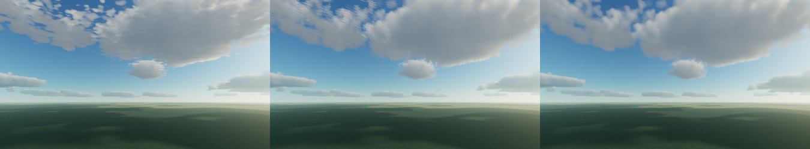

At 64 steps the no-temporal jitter noise is already small (0.38 vs 0.34 /255);
the temporal pass earns its cost mainly by allowing fewer steps and 1/4
updates.

### Debug views

Clouds only, transmittance, cloud depth, raw trace (no reconstruction), plus
weather-map and shadow-map insets.

### Known limitations

- The sun march ignores the Earth's shadow, so after sunset clouds go dark
  rather than keeping their high-altitude glow.
- The weather map is a single tile (45 km by default), so it repeats over
  long flights.
- Reprojection uses one depth per pixel, so thin clouds in front of distant
  ones can smear slightly when the camera moves fast.
- No lightning, precipitation shafts, or light shafts (god rays) through gaps.
- Only verified on SwiftShader (CPU WebGPU); real-GPU frame times have not
  been measured.

## 03 · Watercolour

A real medium rather than a cel shader: the scene is painted as transparent
watercolour washes on cold-press paper, with an optional pen-and-ink layer
(pen and wash). Presets: *Watercolour*, *Pen and wash*, *Wet-in-wet*, *Dry
brush*.

### Frame graph

```
render   shadow        sun depth map (cast shadows become a glaze, not a lighting term)
render   gbuffer       sky wash + scene → pigment absorbance, normal + wetness, depth + id, brush direction + light
compute  edges         ink edges (depth / id / crease) and wash boundaries
compute  bleed ×2      separable wet-in-wet bleeding of absorbance
compute  smear         line-integral smear along the brush direction
compute  composite     paper, wobble, edge darkening, granulation, dry brush, ink, Beer–Lambert
compute  coherence     reprojection error against the previous frame (optional)
render   blit          to the canvas
```

### Techniques and where they live

- **Lighting abstraction** (`gbuffer.wgsl`): wrapped diffuse and a PCF cast
  shadow are reduced to three glazes: paper left light, a mid wash, and a
  darker shadow wash tinted cool, as painters mix blue into shadows. Glaze
  boundaries are soft and jittered by surface noise so they read as brushed
  edges. Distant washes get paler and bluer (aerial perspective).
- **Pigment model**: each wash is stored as absorbance, `−log(pigment) ×
  density`, and the final colour is `paper × exp(−absorbance)` in linear
  light. Bleeding, smearing and edge darkening all operate on absorbance, so
  colours mix subtractively like pigment instead of averaging to grey.
- **World-space brush direction**: every material chooses a stroke direction
  on the surface. Walls and slopes follow the contour (`N × up`), roofs and
  trunks run downhill or vertically, water is horizontal. The direction gets
  a small noise-driven rotation. Streak noise is stretched ~7× along it in
  world space, and a screen-space smear follows its projection, stopping at
  object boundaries.
- **Edge extraction** (`edges.wgsl`): from the G-buffer rather than colour,
  so it is noise-free and moves with the geometry. Only the nearer side of a
  depth or id discontinuity draws, and creases come from normal differences
  within an object. Ink width, pressure and breaks vary with surface noise.
- **Colour bleeding** (`bleed.wgsl`): separable blur of absorbance where
  each tap is weighted by the wetness of both the centre and the sample.
  Pigment only runs between washes that are both wet, while dry washes keep
  hard edges. Wet areas are blobs of surface noise per material (foliage,
  water and sky wettest), so blooms are irregular but stable.
- **Paper** (`composite.wgsl`): a procedural cold-press sheet (round tooth
  plus faint fibres). Pigment interacts with it through granulation (more
  pigment in the valleys), dry brush (thin washes skip the peaks), wobble
  (the image is displaced by the grain) and edge darkening (pigment collects
  at the rim of each wash). Raking light over the relief finishes it.

### Temporal coherence

Stylisation noise is where camera motion breaks NPR. Screen-space noise
stays put while the scene moves under it (the "shower door" effect). Plain
world-space noise follows surfaces, but shrinks into aliasing far away and
blows up close to the camera.

- **Depth-adaptive world noise** (`noise.wgsl`, after Bénard et al.,
  *Dynamic Solid Textures for Real-Time Coherent Stylization*, 2009): two
  octaves of world-space noise one octave apart, chosen from the pixel's
  distance so features stay a fixed number of pixels wide, and blended by
  the fractional octave with a variance-preserving weight. Pigment
  turbulence, glaze jitter, streaks, wet areas, ink pressure and the
  pigment-paper grain all use it. The sky uses the same idea on view
  directions.
- **Dynamic canvas** (after Cunzi et al., *Dynamic Canvas for
  Non-Photorealistic Walkthroughs*, 2003): the paper sheet is neither glued
  to the screen nor to surfaces. Each frame a 12×7 grid of rays is cast on the
  CPU against the terrain, the hits are reprojected into the previous frame,
  and a least-squares 2D similarity (shift + zoom) is composed into the paper
  transform. The grain uses two octaves blended by the fractional zoom level
  (infinite zoom), so its size never drifts.
- **Split paper**: the sheet's relief stays on the dynamic canvas, but how
  pigment sat on that sheet (granulation, dry brush, wobble) belongs to the
  painted surface and uses surface-attached grain. The *Attached to
  surfaces* paper mode moves the relief there too.
- **Measured, not eyeballed** (`coherence.wgsl`): every 4th pixel is
  reprojected into the previous frame through its depth, and the stylised
  images are compared with bilinear lookup. The HUD shows the mean
  difference. The *Temporal coherence* folder switches noise space and
  paper mode to reproduce each failure case.

Reprojection error during a 0.6 rad/s orbit (640×360, 30 fps steps,
SwiftShader), averaged over 40 frames:

| Noise | Paper | Error (/255) | vs naive |
|---|---|---|---|
| screen space | fixed to screen | 8.95 | naive baseline |
| world, fixed scale | dynamic canvas | 7.05 | −21 % |
| world, depth-adaptive | dynamic canvas (default) | 6.45 | −28 % |
| world, depth-adaptive | attached to surfaces | 5.45 | −39 % |

With every paper effect turned off, the same orbit measures 2.1 (world) vs
3.6 (screen). The rest of the default's error is mostly the sheet relief
sliding under a moving scene. That is the price of a sheet that still reads
as paper; attaching it to surfaces removes most of it. A static camera
measures 0.

### Debug views

Pigment before bleeding, light value, brush direction, edges, wet areas,
paper height, coherent noise.

### Known limitations

- The dynamic canvas raycasts only the terrain height field on the CPU;
  buildings and trees don't influence the fitted paper motion.
- Pixel-sized effects (bleed radius, smear, ink width) are in screen space.
  They scale with resolution, but a bloom's footprint changes a little as
  objects approach.
- The smear direction is the projection of a world direction, so strokes on
  surfaces seen edge-on can turn noticeably between frames.
- No pigment simulation (no fluid solve as in Curtis et al. 1997); bleeding
  and backruns are image-space approximations.
- Verified in headless Chromium on SwiftShader only.

## 04 · Portals

Portal-game style portals between three procedural locations: a warm stone
courtyard at golden hour, a cool sci-fi hangar lit by ceiling panels, and a
misty forest clearing. They sit 100 m apart in one world and are enclosed, so
nothing connects them except four portal pairs (A courtyard ↔ hangar, B hangar
↔ forest, C two facing portals in a hangar bay, D courtyard ↔ forest). Each
opening shows its destination from a virtual camera, recursively (portals
seen through portals, up to 8 levels). Objects pass through, and so does the
camera. Walk with `WASD` (`Shift` to run) and drag to look. Walk into an
opening to go through it. Presets: *Through one portal*, *Recursive
corridor*, *Object crossing*, *Walk through*, *Portals in portals*.

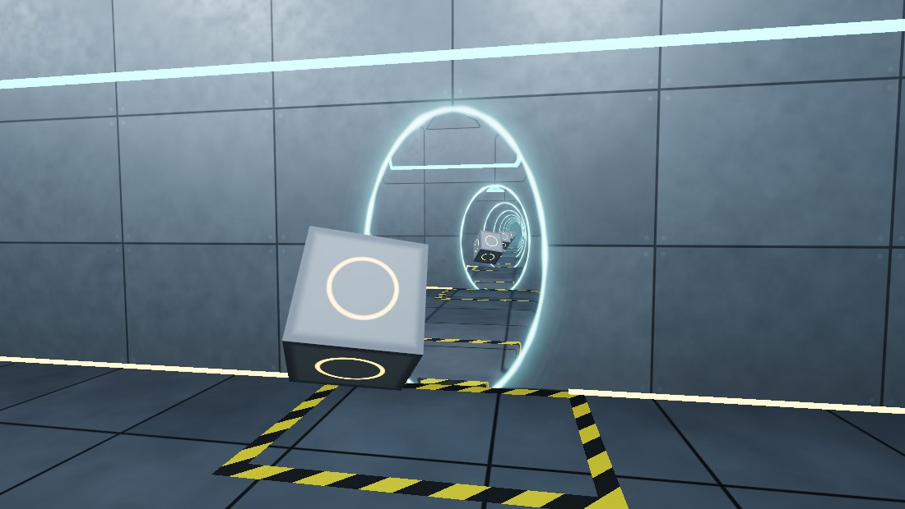
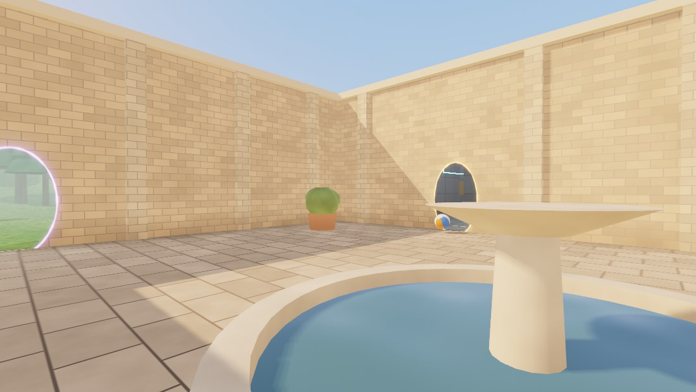

### Frame graph

```
CPU      camera: collisions, teleport through the pair transform when the eye crosses an opening
CPU      objects: unfolded animation, clip planes, duplicates for anything straddling a portal
CPU      view tree: virtual camera, oblique projection and scissor rectangle per visible portal
render   shadow ×2      sun depth maps for the courtyard and the forest (clip planes applied)
render   portal views   one 4× MSAA pass, every view of the tree, depth first:
           sky + depth reset   (stencil == L)
           location geometry   (stencil == L)
           per visible portal: mask (L → L+1) · child view or fill · restore (L+1 → L) · halo
render   post           rim refraction (resample), + glow, debug views, ACES, sRGB
```

### Techniques and where they live

- **Virtual cameras** (`portal-math.ts`): each portal has a world matrix
  (x right, y up, z = normal into its room). The pair transform is
  `T = destination · rotateY(180°) · source⁻¹`, so a point in front of the
  source lands behind the destination. A view through the source uses
  `view · T⁻¹`, and `T⁻¹` is simply the partner portal's pair transform.
  The projection's x/y rows are the camera's own, so the opening shows the
  destination in screen space, like a window, with full parallax.
- **Oblique near-plane clipping** (`obliqueProjection`, after Lengyel,
  *Modifying the Projection Matrix to Perform Oblique Near-Plane Clipping*,
  2005), re-derived for WebGPU's `0 ≤ z ≤ w` and the repo's reversed-Z
  infinite projection (rows `r2 = (0,0,0,n)`, `r3 = (0,0,−1,0)`; near is
  `z ≤ w`, far is `z ≥ 0`). Replace `r2` by `r3 − a·C`, with `C` the
  destination plane in view space (`C·v ≥ 0` on the visible side). The new
  near plane `(r3 − r2')·v = a·C·v ≥ 0` is exactly the portal plane, at depth
  1. Depth becomes `1 − a·(C·v)/(−v_z)`. Along a ray, `(C·v)/t` rises towards
  `C·d` (the camera is behind the plane, `C_w < 0`), so nothing visible is
  clipped by the tilted far plane if `a ≤ 1/max(C·d)`. That maximum is at a
  frustum corner: `a = 1/(|Cx|·tanX + |Cy|·tanY − Cz)`. The far plane then
  touches the frustum only at infinity, depth stays in [0, 1], and the
  clear-to-0 / `greater` convention is unchanged. When the virtual camera is
  closer to the plane than the near distance, the plain projection is used:
  its near plane already removes everything between eye and opening (that
  space is the carved hole), and the oblique matrix would lose its depth
  resolution as `C_w → 0`.
- **Stencil recursion** (`drawView` in `index.ts`, `portal.wgsl`): all views
  share one render pass, one depth-stencil buffer and a dynamic-offset
  uniform slot each. A view at level L draws inside `stencil == L`: first a
  fullscreen sky that writes depth 0 (the depth reset), then its location's
  geometry. Then for every portal it sees, nearest first:
  *mask* the opening (depth-tested against level L, so occluders in front
  keep their pixels; stencil L → L+1), render the child view inside
  `stencil == L+1`, then *restore*. Restore writes the portal surface's depth
  in level L's projection (`always`, stencil L+1 → L), so later portals and
  geometry of level L are occluded correctly by this opening. Because every
  restore leaves true surface depth behind, overlapping portals come out
  right in either order. Nearest-first only means the far one's hidden part
  fails its mask test and is never shaded. The destination portal a view looks
  out of is excluded from that view.
- **Culling and scissors** (`portalRect`, `buildViews`): a child view is
  created only for portals in the view's location that face its camera, lie
  at least partly beyond its clip plane, and overlap its scissor rectangle.
  The rectangle is the opening's 48-gon outline, clipped against a plane
  just in front of the eye (not the near plane, see below), projected, then
  intersected with the parent's rectangle. It shrinks down the recursion, and
  every draw of a view is scissored to it.
- **End of recursion**: at the depth limit (1–8), when the view budget (48
  views by default) is used up, or when a portal is smaller than 6 px on
  screen, the opening is filled with its rim colour. The last levels fade
  towards that colour (`((depth − 1)/maxDepth)²`), so the cut is hard to see.
  Trade-off: a fade costs nothing and never shows stale content, but the
  far end of a corridor is a flat colour instead of more corridor. Portal 2
  reuses the previous frame's image there instead, which looks
  deeper but lags and smears when the camera moves.
- **Crossing without flicker** (`portalCupMesh`, `scene.wgsl`): the opening
  is drawn as a thin cup (front ellipse, side wall and back cap up to 30 cm
  deep). Static geometry discards fragments inside a hole carved behind every
  opening (slightly shallower than the host wall, so from behind the wall is
  solid). When the near plane cuts the front cap, the cup's sides and back
  still cover every ray through the opening. The restore and rim passes map
  those fragments back onto the opening plane.
- **Camera teleport** (`updateCamera`): when the eye's path from the last
  frame crosses an opening from the front, inside the ellipse, the camera
  target goes through the pair transform and its yaw turns by the pair's
  yaw difference. The camera is an `OrbitCamera` at 1 cm distance, i.e.
  first person. Collisions are circle-vs-box in xz. The wall holding a portal
  is ignored while the eye is inside its doorway.
- **Objects crossing portals** (`objects.ts`): a bouncing ball (pair A, real
  g parabolas timed so the middle hop peaks in the opening), a walking robot
  (pair B, seven animated parts) and a spinning cube that loops through the
  facing pair C forever. Each is animated in unfolded coordinates of one
  location. Once its centre is past a plane, the canonical transform goes
  through the pair. While its bounds straddle an opening it is drawn twice:
  the original with a per-draw clip plane keeping the source side, and a
  duplicate through the pair transform keeping the destination side. The
  clip is a fragment `discard`, because `clip-distances` is an optional
  feature. With the oblique near plane and the masks, the clip mostly
  matters where hosts are thin and for shadows. Portal B's forest stone is a
  22 cm slab, and with *Clip planes* off the robot visibly pokes out of its back.
- **Energy rim** (`restoreFs`, `haloFs`, `post.wgsl`): refraction happens only
  in a band at the edge (8.5 % of the radius). Restore writes a screen-space
  offset (rgba8, 128 = 0, ¼ px steps) that pulls the sample radially inwards
  and swirls it with seamless angular noise. The offset is 0 at the band's
  inner edge, so the interior is untouched. The post pass resamples the HDR
  image by it. The rim line, the halo on the wall and a faint inner glow go
  into a separate additive target that is added after the resample, so the
  glow itself stays sharp.
- **Physically consistent touches**: lighting is a function of the world
  position only (courtyard sun with PCF shadows, hangar point lights,
  forest sun and mist), so a surface looks the same directly and through
  any chain of portals. Fog is piecewise: each view fogs only beyond its
  entry plane, and its restore pass fogs the opening by the air in front of
  it, so light is attenuated by each location's air in turn. Each opening
  also acts as a small area light carrying its destination's average
  radiance plus its rim colour (*Light spill*). The moving objects add
  analytic sphere occlusion to the floor.
- **Locations** (`scene.ts`): boxes, cylinders, cones, jittered spheres
  and a height grid, with procedural materials in `scene.wgsl`: running-bond
  brick and flagstones, metal panels with seams and rivets, hazard stripes in
  front of every hangar portal, grass, bark, mossy stone, rippled water.
  Joint lines are filtered by the pixel footprint so distant walls don't
  shimmer. Each location is its own index range, so a view draws only
  the location it looks into (2.4 k / 0.6 k / 32.5 k triangles).

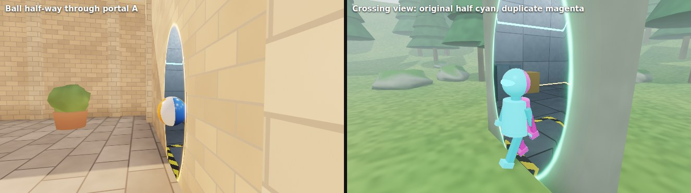
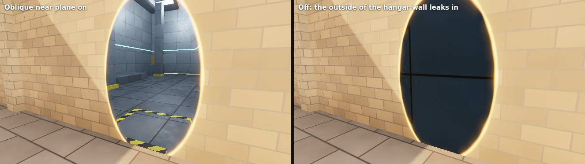
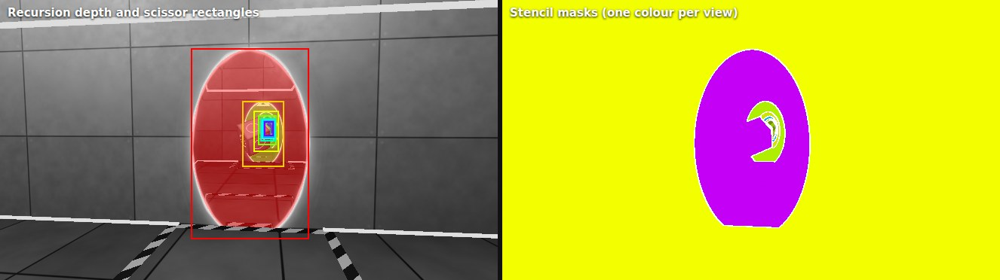

### Verification

Measured in headless Chromium on SwiftShader at 640×360:

| Check | Result |
|---|---|
| Opening vs. a full-screen render from the virtual camera (*Reference camera*, fog and rim off), two camera positions | 0/255 difference over 12,509 and 16,769 pixels (bit-identical) |
| Hangar point projected through the portal vs. the same point moved behind the courtyard wall by `T⁻¹` | same NDC to 1e-6 |
| Oblique matrix, 41×41 frustum directions × 5 distances (0.1 m – 10 km) | 0 points beyond the plane outside [0, 1] (range 0.0005–0.9997), 0 points in front of it kept |
| Walking forward through A at 1.3 m/s, 30 fps: mean frame-to-frame change | teleport frame 2.73/255, neighbouring frames 2.55–2.88 |
| Walking backwards through A (lands 1.3 cm in front of the destination, looking into it) | teleport frame 2.54/255, neighbours 2.11–2.66 |
| Eye 2 cm from the opening, looking straight in and along the wall | no gap or flicker |

Building the parallax check exposed two bugs. The rim target's clear value
0.5 quantised to 128/255 and shifted the whole image by ⅛ px, and a portal
partly outside its parent's rectangle was judged "too small" and filled.

### Cost

Per view: one sky draw, one location draw and the objects in it. Per
visible portal: mask, restore and halo (cup 384 triangles, ring 192). The
corridor preset (8 levels) renders 9 views in 121 draws. One portal renders
2 views in 18 draws, and *Portals in portals* 3 views in 22 draws. Each view's
fragment work is bounded by its scissor rectangle and mask, so deep levels
are cheap. The attachments cost 24 bytes per sample (4× MSAA: HDR
rgba16float, rim offsets and view info rgba8, glow rgb10a2, depth24 +
stencil8), about 240 MB at 1080p including resolves. That is the main memory
cost, and dropping MSAA would cut it to about 50 MB. SwiftShader takes
1.0 s/frame without portals and 1.5–1.8 s/frame for the courtyard and
hangar presets (2.2–3.0 s in the forest). Most of that is the fixed cost of
the 4× MSAA scene pass and two 2048² shadow maps, not the recursion: the
corridor at depth 1 and at depth 8 take the same time. Real GPUs
have not been measured.

### Debug views

`View`: *Recursion depth* (level 0 grey, then one hue per level), *Stencil
masks* (a flat colour per view, the recursion end hatched), *Crossing
duplicates* (original half cyan, duplicate magenta). There are also toggles
for *Scissor rectangles*, *Oblique near plane* (off shows the leak: the far
side of the destination wall), *Clip planes*, and a *Reference camera* that
renders full screen from one portal's virtual camera.

### Known limitations

- The view tree is built depth first, so a long chain can use up the view
  budget before its siblings. They then get the rim-colour fill.
- Light does not travel through portals except as the spill term, which
  uses a fixed average radiance per destination (not the actual image) and
  casts no shadows. Sun shadows stop at the opening, and the hangar has none.
- Portals are vertical. The pair math handles any orientation, but the
  camera (yaw/pitch) and the collisions assume vertical openings.
- Objects are scripted, not simulated, and can straddle one portal at a
  time. An object larger than the opening would cut into the wall.
- The rim refraction is a screen-space resample, so near an occluder in
  front of the rim it can pull in a few pixels of that occluder.
- The oblique far plane is tilted, and depth resolution falls as the eye
  approaches the opening. Below the near distance the plain projection
  takes over.
- Verified in headless Chromium on SwiftShader only.

## 05 · SDF world

A whole world from signed distance functions: a warped-fBm valley with
cliffs and a river, a partly collapsed temple, a domed rotunda, a plaza with
stairs into the water, a two-tier aqueduct that runs to the horizon, an arched
footbridge, a walking character and a floating gyroid sculpture. It is all
sphere traced in one fullscreen fragment shader. Viewpoints: *Temple entrance*,
*Overlook*, *Character close-up* (follows the walker), *Sculpture*, *Rotunda*,
*Aqueduct and bridge*; the camera flies between them.

**The constraint (the extra suffering).** One render pipeline and one draw
of a fullscreen triangle write the final image. There are no meshes, textures,
compute passes, extra render passes or temporal accumulation buffers. Every
pixel rebuilds the world from maths every frame, and all noise is evaluated
analytically. The CPU fills one 256-byte uniform block (camera, sun, time, GUI
values). Everything else, including the character's skeleton, is derived in the
shader. The only other binding is an 8-counter atomic buffer for the cost meter,
written by every 16th pixel on measured frames. Resolution scale shrinks the
canvas backing store and lets the browser upscale, because an upsampling pass
would be a second pass.

### Frame graph

```
render   world      fullscreen triangle, one fragment shader (src/demos/sdf/shaders/world.wgsl + src/shared/sky.wgsl):
                      per pixel: solve character skeleton → sphere trace → shade (shadow, AO, SSS) →
                      0–2 traced reflection bounces (or water: Fresnel + refracted march) → height fog →
                      ACES, sRGB, dither; optional 2×2 in-shader supersampling; debug views
```

### Techniques and where they live

All in `world.wgsl`, which is split into numbered sections.

- **Primitives and operators** (§3–4): boxes, rounded boxes (rounding
  operator), cylinders, capsules, tori, ellipsoids, capped and rounded cones.
  The polynomial smooth min returns its blend weight, and `opSmoothU` uses it
  to blend materials too: skin into cloth on the character, chrome into gold
  on the sculpture's metaballs, echinus into shaft on the columns. Smooth
  subtraction/intersection (`smax`) builds the gyroid lattice and its opening.
  Onion/shelling makes the cella walls, the rotunda drum, the dome and the
  lattice sphere. Elongation (an elongated circle is a stadium) gives every
  round-headed arch: doors, windows, both aqueduct tiers.
- **Domain repetition**:
  - *Infinite*: the aqueduct's arches along x, so it recedes into the haze
    in both directions.
  - *Limited*: the colonnades (11 per side, 4 per front), triglyph grooves,
    cella windows and bridge balusters. The ghat stairs evaluate the two
    neighbouring cells as well, because a taller step next door can be nearer
    than the step in the current cell.
  - *Polar*: 20 flutes per column (carved by subtraction), the rotunda's 14
    columns, 8 windows and 16 dome ribs.
  - *Mirroring*: the temple (|x|, |z|), the twisted columns and the railings.
    The collapsed corner breaks the temple's symmetry by subtracting a lumpy
    ellipsoid from the columns, entablature, roof and cella, leaving broken
    shafts. Fallen drums lie beside it.
- **Deformations**:
  - *Twist*: Solomonic columns, a rounded square twisted 1.25 rad/m, with the
    distance scaled by 1/sqrt(1 + (k·r)²).
  - *Twisted ring*: a square section rotated by 1.5× its sweep angle, so it
    closes seamlessly.
  - *Bend*: the footbridge is a straight deck, railings and balusters bent into
    an arch.
  - *Domain warping*: the terrain (analytic Jacobian, see below) and the
    sculpture. For the sculpture, w = A sin(Bq + φt) is bounded by dividing the
    field by 1 + A·B·√3.
- **Terrain** (§5): the height field is built in four steps.
  - A valley profile across a low-frequency, domain-warped axis: floor, two
    cliff bands with a ledge, mountains.
  - Two noise octaves that wander the cliff line, carving buttresses and
    gullies.
  - Up to 9 octaves of value-noise fBm with analytic derivatives (rotated and
    offset per octave).
  - A flattened plateau under the buildings, and a meandering river channel
    carved through everything. The water is a plane at y = 0.

  **Lipschitz-safe step**: p.y − h is a vertical offset, not a distance. On a
  slope with gradient g the true distance can be as small as
  (p.y − h)/sqrt(1 + |g|²). The shader therefore scales by 1/sqrt(1 + L²).
  Near the ground, L is the local slope: the exact gradient is carried through
  the fBm, the warp Jacobian, the cliff and gully profiles, and the river,
  plus 0.3 of margin for curvature. More than a few metres up, it blends
  (smoothstep over 1–16 m) to the global bound L ≈ 5 (k = 0.2). There a cliff
  may be nearer sideways than the ground below. The global bound everywhere
  would crawl over flat ground at grazing angles, where most terrain pixels
  are. A small overstep that still happens is pulled back by the marcher
  (t += d when d < 0).

  **fBm LOD**: octaves with a wavelength under ~4 pixel footprints are
  dropped, and the last one fades out fractionally so there is no popping. The
  loop also exits early once the point is higher above the partial sum than
  the remaining octaves could reach (±2·amplitude). The early exit returns that
  slack as part of the bound. On the plateau the noise is skipped entirely.
- **Character** (§7): about 20 capsules, ellipsoids and round cones,
  smooth-blended.
  - *Gait*: forward kinematics solved once per pixel into private variables
    (it depends only on time). Thighs swing, knees flex in the swing phase,
    arms counter-swing, and the lower foot is planted, which produces the
    vertical bob.
  - The chest breathes, and the figure walks a circle around the plaza.
  - *Subsurface-ish skin*: wrapped diffuse tinted red, plus back-light
    transmission through thin parts, measured by one field sample 10 cm
    inside.
- **Sculpture** (§8): a chrome core with five gold metaballs orbiting through
  it (smooth union with material blend), a gyroid-perforated onion shell
  opened by a smooth subtraction, and a twisted chrome ring. The whole thing
  is domain warped, spins and bobs over the river.
- **Ray marching** (§10): over-relaxed sphere tracing (Keinert et al.,
  *Enhanced Sphere Tracing*, 2014).
  - Steps are ω·d. When consecutive unbounding spheres don't overlap, the
    marcher steps back and continues with ω = 1.
  - The hit test is a cone, d < ε·t with ε in pixels: a distance-dependent
    epsilon.
  - Rays are clipped to the slab below the scene top and to the water plane.
  - A ray that runs out of steps inside the scene uses its best (smallest
    d/t) sample instead of leaving a hole.
- **Bounding volumes** (§9): each group (temple, plaza, rotunda, aqueduct,
  bridge, character, sculpture) is evaluated only when its box, cylinder or
  sphere is nearer than the best distance so far. That is exact, because the
  bound is a lower bound. Sub-bounds inside groups skip the colonnade, the
  column flutes and the triglyph carving.
- **Lighting** (§11–12):
  - *Soft shadows*: Quilez's improved penumbra estimate, which triangulates
    the closest approach from consecutive spheres. It falls back to k·h/t when
    the spheres don't overlap (h ≥ 2·h_prev after a clamped step or a bound
    jump). Without that fallback the triangulation returns 0 and speckles the
    columns and cliffs black.
  - *AO*: 5 samples along the normal (3 cm to 0.9 m, quadratic spacing), 2 in
    reflections.
  - *Specular*: GGX with height-correlated Smith visibility and Schlick
    Fresnel, and a split-sum environment term (Karis' analytic fit).
  - *Materials*: procedural albedo, roughness and metalness for marble,
    polished tiles, sandstone courses, terracotta, gold, chrome, skin, cloth,
    straw, and terrain (grass/rock/sand/wet/snow by slope and height).
  - *Reflections*: smooth surfaces (polished floors, gold, chrome, water)
    continue the path along the mirror direction. Up to 2 bounces, with ⅓ of
    the primary steps and cheaper shadows and AO. When the bounces run out,
    the path closes with the sky.
- **Water** (§13): an analytic plane, which is the one SDF cheaper to
  intersect than to march.
  - Normals from four directional waves plus drifting noise ripples, faded
    with distance.
  - Fresnel reflection is traced by the path loop.
  - A 28-step refracted march finds what lies beneath (riverbed, the
    submerged stairs). Beer–Lambert absorption acts along both the view path
    and the sun path, with in-scattering and cheap caustics.
- **Sky and fog** (§14): the shared analytic sky (`src/shared/sky.wgsl`) and
  exponential height fog integrated in closed form. The fog colour is the sky
  radiance in the same direction, so geometry fades into exactly the sky
  behind it. A fade over the last quarter of the march distance hides the far
  clip: there is no seam between terrain and sky.

### Performance

GUI: resolution scale (default 0.75), 2×2 in-shader supersampling, max steps
(200), over-relaxation ω (1.5), hit epsilon (0.6 px), max distance (650 m),
bounding volumes and fBm LOD on/off, reflection bounces, shadow steps (64),
penumbra k, AO. The HUD shows the live cost meter.

Measured per pixel with the shader's counters, at the defaults, 480×270, 1
bounce (headless Chromium on SwiftShader; counts are hardware independent):

| Viewpoint | primary steps | shadow steps | reflection steps | map() calls | fBm octaves | group evals | out of steps |
|---|---|---|---|---|---|---|---|
| Temple entrance | 25.6 | 32.5 | 8.7 | 77 | 48 | 43 | 0 % |
| Overlook | 27.1 | 31.5 | 3.2 | 72 | 139 | 4 | 0 % |
| Character close-up | 25.8 | 38.9 | 16.6 | 93 | 62 | 63 | 0.04 % |
| Sculpture | 27.4 | 32.5 | 11.4 | 81 | 176 | 12 | 0 % |
| Rotunda | 25.5 | 24.1 | 1.3 | 60 | 54 | 14 | 0 % |
| Aqueduct and bridge | 29.2 | 25.4 | 3.1 | 67 | 157 | 5 | 0.01 % |

At 960×540 the same views need 5–8 % more (entrance: 27.5 primary steps,
79 map calls), because the epsilon is in pixels. What each optimisation buys:

| | Temple entrance | Overlook |
|---|---|---|
| primary steps, ω = 1.0 / 1.3 / **1.5** / 1.8 | 28.6 / 24.3 / **25.6** / 29.1 | 37.7 / 29.7 / **27.1** / 30.6 |
| group evaluations per pixel, bounds off → on | 542 → 43 (12.7×) | 504 → 4 (126×) |
| fBm octaves per pixel, LOD off → on | 56 → 48 | 198 → 139 (−30 %) |

Over-relaxation pays most on long grazing terrain rays (−28 % steps on the
overlook). Above ω ≈ 1.5 the failed steps (which step back) eat the gain.
The steps heatmap shows where it helps: the distant slopes and the sky
just above the mountains, the red band where rays graze a ridge.

**Cost estimate (not measured on a GPU).** About 60–95 map() calls per pixel.
A call averages very roughly 200–400 ALU operations: plateau terrain is ~30,
warped terrain ~150 plus ~50 per octave, and the temple group ~400. That is
about 20–30 k operations per pixel, or 45–65 G per 1080p frame. On a
~10 TFLOPS mid-range GPU at a realistic 30–50 % efficiency (divergent loops),
that is roughly 10–20 ms at full 1080p and 5–11 ms at the default 0.75 scale.
It is only verified on SwiftShader (CPU), where 480×270 takes 5–20 s per frame.

### Debug views

`View` in the GUI:
- **Steps heatmap**: primary steps, 0 → 100, turbo colour map with a
  legend bar along the bottom.
- **Cost heatmap**: every map() call of the pixel (primary, normals, shadow,
  AO, reflection, water), 0 → 400.
- **Normals**, **AO only**, **Shadows only**.
- **Material ids**, blended where smooth unions blend materials.
- **Distance field slice**: a horizontal or vertical plane at a chosen
  offset, coloured by map() (orange outside, blue inside). It has contour lines
  every *spacing* metres, antialiased by the pixel footprint, and a white
  zero iso-line. It shows what the tracer really sees, including the
  Lipschitz-scaled terrain distance and the lower bounds returned by
  bounding volumes.

### Known limitations

- One sample per pixel by default. Fine detail (flutes, balusters, triglyph
  grooves, distant aqueduct arches) aliases and shimmers in motion. The
  in-shader 2×2 supersampling fixes that at 4× the cost. Temporal
  anti-aliasing is ruled out by the no-history constraint.
- The terrain's local Lipschitz estimate is first order. On sharply convex
  bumps it can overstep a few centimetres before the pull-back.
- Shadows in terrain penumbras come out softer and darker than they should,
  because the Lipschitz scaling makes terrain distances underestimate.
- Soft shadows, AO and the gyroid are approximations. The gyroid sheet
  distance is only a bound, and the ellipsoids use the usual bound, not an
  exact distance.
- Reflections are mirror-only, blended to a sky-based term for rough
  surfaces; there are no glossy traced reflections. Water refraction ignores
  total internal reflection, and the caustics are a noise pattern, not
  photon-derived.
- The walker's feet are not solved by IK: the planted foot can slide a little
  over the stride.
- There is no collision: the camera can fly into the geometry. The eye is
  only kept above the water.
- Numbers come from headless Chromium on SwiftShader. Real-GPU frame times
  are an estimate, not a measurement.

## 06 · Black hole lensing

Light bent around a Schwarzschild black hole, with a thin accretion disk and a
procedural sky behind it. The study starts from the usual artistic shortcut
and ends at exact null geodesics. Every stage stays selectable, and a split
screen puts the artistic and physical renders side by side. Units are
Schwarzschild radii (r_s = 2GM/c² = 1) and r_s/c. Presets: *Inclined*,
*Edge-on (Interstellar-like)*, *Face-on*, *Einstein ring alignment*,
*Artistic vs physical (split)*, *Shadow measurement*, *Photon ring close-up*,
*Free fall at 5 r_s*.

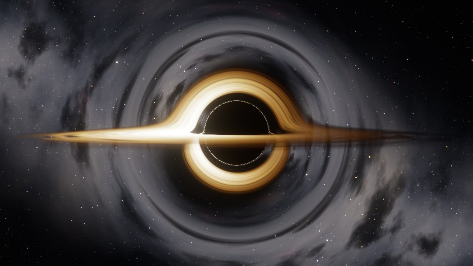
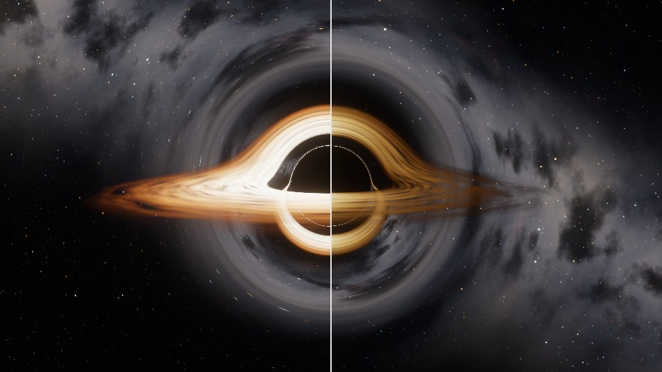
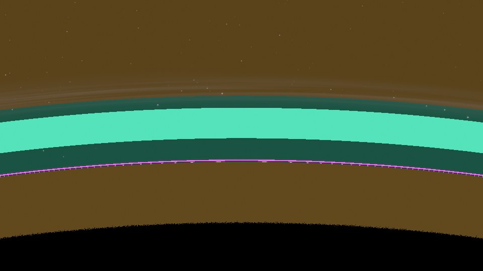

### Frame graph

```
compute  trace        per pixel: camera ray (+ aberration), geodesic, disk crossings,
                      prefiltered sky lookup → HDR, debug data, statistics (atomics)
compute  accumulate   progressive mean of jittered frames (or a copy)
compute  bloom down   6 levels, 13-tap, Karis average on the first
compute  bloom up     5 levels, 3×3 tent
render   composite    bloom mix, exposure, ACES, sRGB, debug views, split-screen line
```

### Techniques and where they live

- **Stage 1, artistic** (`geodesic.wgsl` `traceArtistic`): march in flat space
  with a step ∝ r and pull the direction towards the hole with an
  inverse-square term, `v = normalize(v - k x/r³ ds)`. The horizon is a black
  sphere at r = r_s, and the disk is a plane hit found by linear
  interpolation, with a fixed colour ramp and no redshift. It has no photon
  sphere, so the higher-order images and the shadow size are wrong.
- **Stage 2, exact geodesics in the orbital plane** (`tracePlane`). A photon
  moves in the plane spanned by the hole, the camera and the ray. In that
  plane u = 1/r obeys the Binet-form orbit equation
  `d²u/dφ² + u = 3Mu² = (3/2) r_s u²`. Each ray gets a basis (e1 towards the
  camera, e2 the direction it turns towards, e3 = e1 × e2) and becomes a 1D
  ODE in φ.
  - *Initial slope.* The camera is a static observer, and its local frame
    stretches the radial component by (1 - r_s/r)^(-1/2). A ray at angle θ from
    the outward radial therefore starts with `du/dφ = -u √(1 - u) cot θ`
    (r_s = 1). Check: this satisfies the first integral
    `u'² = 1/b² - u² + u³` with Synge's `b = r sin θ / √(1 - r_s/r)`.
  - *Integration.* RK4 at a fixed dφ, or adaptive Dormand–Prince 5(4) (the
    ode45 pair, FSAL). Its error norm is `|δ(u, u')| / |(u, u')|`, which for a
    straight line `u = sin(φ∞ - φ)/b` is exactly the escape-angle error,
    whatever the impact parameter. A fixed dφ is already a step ∝ r in space.
  - *Exact events.* The photon plane cuts the disk plane along a line of
    nodes, so disk crossings happen at φ = φ_ℓ + kπ. Steps are clipped to land
    on them exactly. Escape is the root u = 0 on the last step's cubic Hermite
    interpolant: an exact asymptotic direction with no escape radius and no
    tail correction. A ray inside the photon sphere with u' > 0 has u'' > 0 and
    can never turn back, so it is stopped there as captured.
- **Stage 2b, Cartesian cross-check** (`traceCartesian`). The same geodesics
  as flat-space motion under a pseudo-force. For a central force f(r), Binet's
  equation is `u'' + u = f/(h²u²)`. Setting `f = (3/2) r_s h² u⁴` gives
  `a = -(3/2) r_s h² r̂ / r⁴` with `h = |r × v|` conserved: the constant is 3/2,
  not 3. It is integrated with RK4 at a step of k·r in 3D, with the same
  metric-corrected start velocity. Disk hits come from a Hermite/Newton plane
  crossing. The r⁻⁴ force decays fast, so the path stops at 2·r_obs and adds
  the remaining bending to first order along a straight line: the integral of
  `(3/2) b³ ∫ ds/(b² + s²)^(5/2)`, with a series form for s ≫ b.
- **Ray differentials** (`tracePlane`, `env.wgsl`). Alongside u the shader
  integrates the variational equation `w'' = (-1 + 3u) w` for w = ∂u/∂p,
  where p = du/dφ at the camera. At escape, `∂φ∞/∂p = -w/u'`. A pixel step
  changes p through θ and rotates the orbital plane about e1. Those two
  derivatives come from the camera's own differentials (central differences
  of the camera and aberration mapping). Together they give the exact
  Jacobian of the escape direction with respect to the pixel, J = [∂D/∂x,
  ∂D/∂y], without tracing extra rays. The same chain rule, with dφ_c from
  `N·e(φ_c) = 0`, gives the hit-point differentials on the disk. The
  alternative *Finite differences* mode traces the neighbouring rays
  instead, falling back to the other side when a neighbour falls in. The
  Cartesian integrator carries no differentials, so it uses finite
  differences too.
- **Prefiltered sky** (`env.wgsl`). Each pixel integrates the sky against a
  Gaussian with covariance `Σ = k² J Jᵀ` on the celestial sphere (EWA
  filtering in the spirit of Heckbert 1989 and Igehy 1999). Lensing conserves
  surface brightness, so this is what a camera records: magnified stars get
  brighter, demagnified sky averages out.
  - *Stars.* Nine levels of an equi-angular cube map, 4·2^L cells per face
    edge, at most one star per cell, 0.3× the flux per level (4× the count). A
    level is summed star by star (2×2 cells, so the kernel's 3σ must fit in
    half a cell) while it is resolved. Once the footprint outgrows it, the
    level fades to its exact mean radiance, `flux · presence · density /
    Ω_cell`: the level's "top mip". Stars in edge cells keep half a cell away
    from the face edge, so no star is ever needed from across a seam.
  - *Galaxy.* A Gaussian band and bulge with fBm structure, dust lanes and Hα
    patches, all functions of the 3D direction (no seams). Noise octaves fade
    with the footprint. The Gaussian profiles are blurred analytically
    (variance v → v + σ²), so right at the photon ring the band spreads over
    the sky instead of aliasing.
  - *Colour.* Stars and galaxy light are blackbodies, so the observer's
    blueshift turns T into g·T for them too.
- **Accretion disk** (`disk.wgsl`). A thin annulus from the ISCO (3 r_s) out.
  - *Temperature.* `T ∝ r^(-3/4) (1 - √(r_in/r))^(1/4)`, peaking at
    49/36 r_in (zero-torque inner edge, so the ISCO rim is dark). The peak
    temperature is a display choice (4600 K by default); a real disk is
    10⁴–10⁷ K.
  - *Blackbody table* (`blackbody.ts`). Planck spectra integrated against the
    Wyman–Sloan–Shirley CIE fits, converted to linear sRGB, and white-balanced
    to 6500 K.
  - *Turbulence.* fBm in (azimuth, ln r), with streaks about 4× longer than
    wide, advected at the Keplerian Ω = √(M/r³). Differential rotation would
    wind any pattern up without bound. Two copies are advected over a finite
    cycle (default: one inner-edge orbit), restarted with fresh seeds, and
    cross-faded with a variance-preserving weight (flow noise with periodic
    reset). Noise octaves are prefiltered with the hit-point differentials,
    measured in the noise's own anisotropic metric.
  - *Coverage.* `1 - exp(-τ ρ)` per crossing, front to back, so gaps show
    the higher-order images and the sky behind.
  - *Light travel time.* The coordinate time `dt/dφ = r²/(b(1 - r_s/r))` is
    integrated with the same stages as u. In the Cartesian form it is
    `dt/dλ = √(1 - r_s/r_obs)/(1 - r_s/r)`. Each crossing samples the disk at
    `t_now - Δt`. The secondary and photon-ring images therefore lag the
    direct image by up to a few tens of r_s/c (the *Light travel time*
    toggle).
- **Redshift** (`diskRedshift`). The gas moves on circular geodesics with
  local speed `β = √(M/(r - 2M))` along φ̂ = N × r̂, as a static observer
  measures it. The photon's direction at the hit comes from the plane state
  `(u, u')`. The Doppler factor is `δ = 1/(γ(1 - β φ̂·k))`, the gravitational
  factor is `√(1 - r_s/r)`, and the observer's blueshift is
  `1/√(1 - r_s/r_obs)`. The product is algebraically the textbook
  `g = √(1 - 3M/r) / (1 - Ω b_z)`: substitute γ, and
  `φ̂·k = (b_z/r) √(1 - r_s/r)`.
  - *Intensity.* I_ν/ν³ is invariant, so a blackbody at T is seen as a
    blackbody at g·T. The default *Spectral* mode looks up g·T. That is
    exact, and it is what the eye sees in the visible band. The Wien side
    makes the brightness change faster than g⁴ at display temperatures.
  - *Other modes.* *× g⁴* is the bolometric (frequency-integrated) law, as
    in Luminet 1979 and most papers. *× g³* is specific intensity at a fixed
    frequency, for a flat spectrum. Both keep the colour at T. The toggles
    switch Doppler and gravity separately.
- **Observer** (`trace.wgsl`). The camera is a static observer at r_obs.
  Optionally it moves: free fall from rest at infinity (β = √(r_s/r) inwards),
  or a circular orbit about the disk axis. Each pixel's direction is aberrated
  into the static frame, and the observer Doppler factor γ(1 + β·n) scales
  every g. An off-axis view window (lens shift) zooms into the photon ring
  without moving the camera.
- **Accumulation** (`accumulate.wgsl`). With *Accumulate* on, time freezes
  and R2-jittered frames are averaged until anything changes. It is used for
  reference images and the sub-pixel shadow measurement. The live image
  relies on the prefiltering.

### Verification

Measured in headless Chromium on SwiftShader. The float64 references come
from a CPU integrator (RK4, dφ = 2·10⁻⁴).

| Quantity | Theory | Rendered |
|---|---|---|
| critical impact parameter b_c (float64 bisection) | 3√3/2 = 2.598076 | 2.598076 |
| shadow b from captured-pixel area, 16 jittered frames, r_obs = 10 / 30 / 100 | 2.5981 | 2.5978 / 2.5980 / 2.5982 (≤ 0.01 %) |
| same, Cartesian integrator, r_obs = 30 | 2.5981 | 2.5980 |
| shadow edge on a 3·10⁻⁶° pixel scan, r_obs = 26 (Synge) | 5.623179° | first captured pixel 5.623177–5.623183° |
| Einstein ring of the beacon star, r_obs = 30 (float64 φ∞ = π; weak field gives 14.79°) | 16.1825° | 16.1826° (brightness-weighted radius) |
| face-on disk, b_z = 0: g = √(1 - 3M/r) / √(1 - r_s/r_obs) at r = 3 / 14 | 0.723 / 0.967 | 0.724 / 0.967 |
| photon ring images: distance of the m = 3, 4, 5 band edges from the shadow edge | ratio e^π = 23.1 | 0.00786°, 0.000335°, ≈ 0.000016°: ratios 23.5 and ≈ 21 |
| artistic stage (pull 1), r_obs = 30 | 4.884° | 4.960° (equivalent b = 2.638) |

The shadow is measured in the app. Captured pixels are counted with GPU
atomics. A disc of angular radius α centred on the view axis covers
π tan²α of the image plane, so α = atan √(N·A_px/π), which is inverted with
Synge's `sin α = (b_c/r_obs) √(1 - r_s/r_obs)`. The HUD shows it live; for
exact numbers use the *Shadow measurement* preset, with the disk off and
accumulation on.

Image order m is the number of disk-plane crossings before escape or capture
(Gralla, Holz and Wald 2019). The *Photon ring close-up* preset shows the m = 2
lensing ring and the m ≥ 3 photon ring, which each shrink by e^π per order.
At an inclination of 11° the images that hit the disk alternate with bands
that cross the plane inside the ISCO.

Accuracy and cost of the integrators (Inclined preset, 480×270, disk on).
The reference is RK4 at dφ = 0.01. Escape-direction errors are against the
float64 integrator over 142 sample pixels. One 1080p pixel at 50° is
8·10⁻⁴ rad.

| Integrator | steps/px (max) | derivative evals/px | mean \|Δ\| vs reference | escape direction error (mean / max) |
|---|---|---|---|---|
| plane RK4, dφ = 0.2 | 15.5 (49) | 62 | 0.064/255 (0.06 % px > 8/255) | |
| plane RK4, dφ = 0.08 | 37.3 (120) | 149 | 0.004/255 | 8·10⁻⁶ / 2·10⁻⁵ rad |
| plane DP5(4), tol 10⁻⁴ | 6.7 (22) | ~40 | 0.046/255 | |
| **plane DP5(4), tol 10⁻⁶ (default)** | 12.5 (31) | ~75 | 0.001/255 | 9·10⁻⁶ / 2·10⁻⁵ rad |
| Cartesian RK4, step 0.1 r | 41.2 (140) | 165 | 0.36/255 (0.03/255 with equal footprints) | 1·10⁻⁶ / 1.5·10⁻⁵ rad |
| artistic, step 0.04 r | 102.6 (388) | 103 | 12.2/255 (20 % px > 8/255) | wrong physics |

All the geodesic integrators agree far below a pixel. The plane
integrators' ~10⁻⁵ rad is a float32 floor that does not shrink with the step.
Coarse RK4 steps show up in the light-travel-time integral first (the disk
pattern shifts), not in the directions. Most of the Cartesian difference
comes from its cruder footprints (finite differences for the sky, unlensed
for the disk). With footprints off in both, it is 0.03/255 whatever its step
(k = 0.2 → 0.05 gives the same). Its escape directions are actually closer
to float64 (10⁻⁶ rad); the lensed galaxy near the Einstein ring is magnified
enough to show the plane reference's 10⁻⁵ rad. The two formulations also
agree on the light-travel delay at the first disk hit: mean difference
2·10⁻⁴ r_s/c over 12,900 pixels, at the f16 storage limit, for delays of
13–60 r_s/c. The finite-difference footprint costs 24 extra steps/px on top
of 12.6 with DP5(4); the analytic one costs two more ODE components.

Sparkle, measured as frame-to-frame change in a slow orbit (0.0005 rad/frame
≈ 0.15 px, 480×270, disk off):

| Footprint | 1–1.25 shadow radii | 1–2 shadow radii | whole frame |
|---|---|---|---|
| none (unlensed pixel, typical shadertoy) | 0.259/255, 0.40 % px > 8/255 | 0.236/255 | 0.258/255 |
| analytic ray differentials | 0.006/255, 0 % | 0.063/255 | 0.230/255 |
| finite differences | 0.006/255, 0 % | 0.063/255 | 0.230/255 |

The whole-frame number is dominated by ordinary unlensed stars moving. Next
to the shadow the flicker drops about 40×. The filter conserves energy. Mean
radiance in annuli, 1 spp prefiltered vs 64 jittered point samples: within
0.3 % at 2–4 shadow radii and 0.9 % at 1.3–2. At 1.1–1.3 it is 12 % higher,
where a handful of demagnified bright stars dominate the 64-sample
reference.

No non-finite pixel appeared in any test (the HUD counts them): static
observers at 1.6 r_s looking in, out and sideways, free fall at 1.2 r_s
(inside the photon sphere), a circular orbit at 3 r_s in the disk plane, and
all integrators and presets. Static observers are kept outside 1.05 r_s.

### Performance

The trace is one compute pass with no textures. Per pixel it runs about 75
derivative evaluations (DP5(4)), up to 9 × 4 star cells, 15 gradient-noise
octaves for the galaxy, and 16 per disk crossing. The procedural noise, not
the integration, dominates. By operation count that should fit 1080p60 on a
mid-range GPU, but real GPUs have not been measured. On SwiftShader (CPU)
the default view takes about 2 s per frame at 480×270 and 12–18 s at 960×540.
The knobs: integrator and tolerance/dφ, footprint mode (finite differences
roughly triples the ray count), disk optical depth (opaque disks stop rays
early), and *Statistics in HUD* (workgroup-reduced atomics).

### Debug views

`View` in the GUI:
- *Steps per pixel*: log scale, including rejected adaptive steps.
- *Disk crossings (image order)*: m = 1 / 2 / 3 / ≥ 4 in orange / green /
  magenta / white; full colour where the disk was hit, dim where it wasn't.
- *Escaped / captured*: also shows the step limit and rays absorbed by the
  disk.
- *Redshift factor g*: at the first crossing, red below 1 and blue above,
  log scale from ½ to 2.
- *Sky footprint size*: log₂ of the footprint's linear size against an
  unlensed pixel.

The HUD adds steps/px, capture fractions, image-order counts, non-finite
pixels and the live shadow measurement.

### Known limitations

- Schwarzschild only: no spin (Kerr), so no frame dragging and no asymmetric
  shadow.
- Light travel time delays when each image samples the disk, but the
  observer's own proper time is not used: the animation runs in coordinate
  time (a factor √(1 - r_s/r_obs) off for a static observer).
- The disk is geometrically thin, with no vertical structure,
  self-illumination, corona or jet. Its opacity is a single 1 - e^(-τ) layer
  per crossing. The temperature is a display temperature.
- The turbulence cross-fade restarts the pattern once per cycle. Far out,
  where it barely turns within a cycle, it can read as slow "breathing"
  rather than rotation.
- The disk texture filter is isotropic: it uses the largest axis of the
  footprint ellipse, so grazing views blur more than an anisotropic multi-tap
  filter would. The artistic and Cartesian paths use an unlensed footprint
  estimate for the disk.
- Geometric edges (the shadow rim, the disk's inner edge, image-order
  boundaries) are not prefiltered. Only accumulation antialiases them, and the
  m ≥ 3 rings are sub-pixel at normal zoom.
- The circular-orbit observer is a geodesic only in the disk plane. The
  camera orientation is taken from the orbit camera, not parallel-transported.
- Verified in headless Chromium on SwiftShader only.

## 07 · Magical materials

Materials meant to look supernatural rather than "emissive + noise". The
rule of the study: **one procedural field, every effect derived from it**.
An animated object-space field (curl flow, advected energy filaments, a
slowly evolving charge potential and a Voronoi crack network) drives the
interior light, the cracks, the rim, the scattering, the heat haze, the
particles and even the light the object casts on the altar, so everything
moves together. Presets: *Enchanted crystal*, *Cursed obsidian*, *Arcane
metal*, *Frozen soul ice*, *Void stone*. Shapes: sphere, crystal cluster,
torus knot. The scene is a ruined moonlit temple (pillars, braziers with
flames, engraved rune circle, fog) so refraction and distortion have
something to bend.

### Frame graph

```
compute  bakeShape     96³ SDF + normal of the current shape            (on shape change)
compute  bakeCracks    128³ crack distances, two scales, cell id        (on crack-scale change)
compute  bakeField     N³ (default 72³): v + C, advected noise n, ∇C     (every frame)
compute  probeField    one workgroup: the object's emitted light         (every frame)
compute  simulate      particles: spawn on open cracks, curl advection   (every frame)
render   shadow        moonlight depth map of the static temple          (once)
render   env cube ×6   temple from the object's centre, 128², + 5 prefiltered mips (every 2nd frame)
render   scene         sky, temple, flames → HDR, alpha = view distance
render   warp          heat haze / space warp of the scene around the object
copy + render mips     scene mip chain (13-tap), sampled by frosted refraction
render   object        surface + interior march + refraction
render   particles     additive streaks, depth-tested against scene and object
render   bloom         6 levels down (Karis on the first), 5 up (tent)
render   composite     bloom, exposure, ACES, vignette, sRGB, dither, debug views
```

### The field (`field.wgsl`, baked by `bake.wgsl`)

- **Flow v**: curl noise (Bridson et al., *Curl-Noise for Procedural Fluid
  Flow*, 2007) from analytic-derivative gradient noise, plus a
  divergence-free swirl about the object's axis. The potential is
  multiplied by Bridson's ramp of the shape's distance, so the velocity is
  tangent to the surface: energy circulates inside, air streams around.
- **Energy E**: two advected noise values whose ridges are multiplied, which
  is large only near the intersection curves of two zero sets, i.e. thin
  filaments. Advection is two-phase flow noise (Neyret, *Advected
  Textures*, 2003): each phase is displaced along v for a bounded time and
  re-seeded, and the phases are blended with variance-preserving weights, so
  filaments morph and reconnect instead of cross-fading. The *smooth* noise
  values are baked and the ridge nonlinearity is applied per sample, which
  keeps filaments sub-voxel sharp at a 72³ bake (the same reason SDFs
  interpolate well). Baking the finished E instead gave blotches.
- **Charge C**: slow drifting noise plus surges that sweep through the
  object along a turning axis; its gradient is baked separately.
- **Cracks**: exact distance to Voronoi cell borders (two-pass, Quilez) at
  two scales with a low-frequency domain warp; static in object space like
  real fractures. `crackOpen(C, E)` decides how open each crack is.

### Techniques and where they live

- **Interior energy** (`object.wgsl` `marchInterior`): the view ray is
  refracted in, the exit distance is found by sphere tracing −SDF, then the
  chord is marched with a step count proportional to its length (4…max,
  jittered with IGN). Each step: Beer–Lambert absorption (preset absorption
  plus energy-dependent extinction), exact per-step integral of emission,
  energy hidden under a clear "skin" depth so it floats inside with
  parallax, glowing fracture *sheets* continuing the crack network into the
  volume (fading with depth), and in-scattered moonlight estimated from the
  depth below the surface. The ray bends along ∇C: a gradient-index medium
  whose index follows the charge, so the energy itself refracts light.
  Early out at 1 % transmittance.
- **Refraction** (`refractedBackground`): the scene is rendered first
  (distance in alpha, warped by the haze). At the exit point the ray is
  refracted out per colour channel (dispersion), extended by the scene depth
  behind the pixel, projected, and looked up in the scene mip chain at the
  frost level. Total internal reflection falls back to the reflection cube.
- **Cracks on the surface**: the same crack function evaluated analytically
  per pixel (pixel-exact, anti-aliased with `fwidth`), width = f(opening);
  hot core, glow, and a small light leak around them; closed cracks remain
  as faint hairlines. The groove tilts the normal along ∇(crack distance),
  which is exact for the bisector-plane distance.
- **Fresnel and rim**: Schlick Fresnel against a prefiltered reflection cube
  rendered from the object's centre every other frame. The rim corona is
  powered by the field sampled just *outside* the surface, so it flickers
  and streams with the flow instead of being a constant rim.
- **Subsurface look**: translucency after Barré-Brisebois & Bouchard (GDC
  2011) using the thickness the march just measured, wrap lighting, and the
  in-scattering term inside the march. Inner energy bleeds through thin
  parts naturally because thin chords absorb less.
- **Arcane metal**: anisotropic GGX with height-correlated visibility
  (Heitz 2014), brushed along the mesh tangent, and Filament's bent normal
  for the environment. The crack network becomes engraved channels, and
  each crack cell carries a procedural sigil (rings, a k-gon, spokes, ticks)
  in the cell's tangent plane that *draws itself* around its circle as the
  charge at the cell's feature point rises. Channels and sigils are windows
  into the same interior energy: a short 10-step march beneath them.
- **Heat haze / space warp** (`warp.wgsl`): rays through a halo sphere
  integrate the flow (weighted by energy, charge and closeness to the
  surface) on 6 jittered samples outside the object and project it to a
  screen offset, with a slight chromatic split. Only background farther
  than the halo entry is warped. *Void stone* adds a lens term ∝ 1/impact²
  that pulls the background around the object.
- **Particles** (`particles.wgsl`): a dead particle proposes a random
  surface point (projected onto the SDF) and is born with probability ∝
  crack opening × energy there, so emission follows cracks as they open.
  Alive particles relax toward the curl velocity (plus preset buoyancy), are
  pushed out if they enter the object, and fade over their lifetime. Drawn
  as additive sprites stretched along their screen motion; sub-pixel sprites
  are widened to 1 px with the same energy to avoid sparkle.
- **The object as a light** (`probeField`): one workgroup averages the
  field's emission over a 6³ lattice inside the shape; the temple, the
  engraved rune circle, the fog glow and the reflection cube are lit by
  that, so the light on the altar pulses with the interior energy.
- **Scene** (`env.wgsl`): concentric flagstones, masonry courses, moonlight
  with a PCF shadow map, a soft spherical occluder for the object's shadow
  (as opaque as its material), flickering braziers with billboard flames,
  height fog with closed-form point-light single scattering, starry sky with
  moon and mountain silhouettes. Bloom is the Call of Duty 13-tap chain
  (Jimenez 2014), then ACES (Narkowicz fit).

### Debug views

Field slice (E red, C green, |v| blue, SDF outline, open cracks), crack
mask (primary, secondary, opening), thickness, interior march steps, particle
density, refraction offsets, distortion offsets, reflection cube.

### Performance

Costs scale with the object's screen coverage (the march), the particle
pool and the bake resolution. Knobs: max march steps (40), bake resolution
(72³), particle pool (64k, up to 256k; the spawn probability is normalised
by the pool size, so the pool is a capacity and *Spawn rate* sets the
density), env cube interval (every 2nd frame). The interior
march is bounded: the exit is found first, so the step count adapts to the
chord length, and it ends at 1 % transmittance. Per frame at defaults the
field bake is 373k voxels × ~11 noise evaluations; the surface pays two
27+27-cell Voronoi passes per pixel.

Measured in headless Chromium on SwiftShader (CPU WebGPU) at 640×360, on
a 4-core machine shared with other jobs (load average 10–16, so timings
are noisy): 3.4–8 s per frame depending on preset and how much of the
screen the object covers. Toggling passes on that setup: updating the
reflection cube every frame costs about as much as the main scene
(≈5.0 → 2.2 s/frame with it frozen), and a 131k particle pool against 16k
(before spawn normalisation, when most of the pool was alive) was
≈5.7 → 2.4 s/frame. The one-off crack bake (128³, two Voronoi scales) takes
a few seconds on SwiftShader. None of this has been timed on a real GPU;
the budget reasoning is: one 72³ bake of ~11 noise evaluations per voxel,
≤40 steps × 5 texture fetches per covered pixel, and a few hundred
thousand small additive sprites.

### Known limitations

- The crack displacement is a normal perturbation (and the interior fracture
  sheets give depth); the silhouette is not displaced.
- Refraction is screen-space: what is off screen or hidden behind the
  object falls back to the reflection cube, and there is one refraction
  event in and one out (internal bounces are approximated by the cube).
- The reflection cube is rendered from the object's centre, so reflections
  of nearby geometry (the pedestal) are parallax-approximate, and the cube
  filter is a cone blur, not a true GGX prefilter.
- Particles do not collide with the temple and are not sorted (additive
  blending does not need it); they are depth-tested but not soft.
- The moon shadow of the object uses a spherical occluder, not the shape.
- Only verified in headless Chromium on SwiftShader (CPU WebGPU).

## 08 · Atmospheric scattering

A physically based sky and aerial perspective after Hillaire, *A Scalable
and Production Ready Sky and Atmosphere Rendering Technique* (EGSR 2020),
with the transmittance parameterisation of Bruneton & Neyret, *Precomputed
Atmospheric Scattering* (EGSR 2008). The camera goes from a mountain valley
to 20,000 km, over a spherical planet with a 400 km mountain patch, oceans
and continents. Everything reusable lives in `src/shared/atmosphere/` and
the procedural planet (05) uses the same module. Presets: *Noon*, *Morning,
mountains*, *Afternoon*, *Sunset*, *Twilight*, *Earth shadow*,
*Stratosphere*, *Low orbit, limb*, *Low orbit, sunrise*, *From orbit*, and a
Mars-like atmosphere (*Mars, afternoon / sunset / from orbit*).

### Frame graph

```
compute  terrain heights + gradients   1024² mountain patch (once)
compute  transmittance                 256×64, 40 samples        (when the medium changes)
compute  multiScattering               32×32 × 64 directions     (when the medium changes)
compute  irradiance                    64×16 × 64 directions     (when the medium changes)
compute  skyView                       192×108, 24–40 samples    (every frame)
compute  aerial                        32×32×32 froxels          (every frame)
compute  scene                         per pixel: height-field march, ground shading + AP, or sky + sun
compute  reference + compare           brute force at 1/4 res and error statistics (on demand)
render   composite                     exposure, ACES, sRGB, debug views
```

### Techniques and where they live

- **Medium** (`shared/atmosphere/common.wgsl`): Rayleigh (5.802, 13.558,
  33.1)·10⁻⁶ /m with an 8 km scale height; Mie scattering 3.996·10⁻⁶ /m and
  absorption 0.444·10⁻⁶ /m (extinction 4.44·10⁻⁶, the paper's values;
  the absorption slider covers other choices) with 1.2 km and a
  Cornette-Shanks phase, g = 0.8 (per channel, for Mars); ozone (0.650,
  1.881, 0.085)·10⁻⁶ /m in a tent 30 km wide centred at 25 km. Planet
  6360 km, top 6460 km. Units are km so float32 is comfortable, and every
  ray/sphere test from the camera takes the double-precision altitude and
  forms `c = h (2R + h)` instead of `r² − R²`.
- **Transmittance LUT** (`generate.wgsl` `transmittance`): Bruneton's
  (x_μ, x_r) mapping, which puts texels where the horizon changes fastest.
  Only directions above the horizon are stored; the Earth's shadow is a
  separate test, softened over the sun's angular radius so the terminator
  does not alias.
- **Multiple scattering** (`multiScattering`): Hillaire's Ψ_ms. For each
  (sun zenith, altitude) texel one 64-thread workgroup integrates 64
  directions (single scattering with an isotropic phase plus sunlight
  bounced off the ground albedo, and the transfer f_ms), reduces them in
  shared memory and stores L₂ / (1 − f_ms), the sum of all orders.
- **Sky irradiance LUT** (`irradiance`): not in Hillaire's paper, but the
  ground needs skylight. Cosine-weighted hemisphere of 64 directions through
  the LUT-based integrator; used for ground and water.
- **Sky-view LUT** (`skyView`): 192×108 around the camera's zenith, with
  Hillaire's non-linear latitude mapping (sqrt towards the horizon) and
  azimuth measured from the sun (sqrt towards it). Rebuilt every frame.
- **Aerial perspective** (`aerial`, `lookup.wgsl`): 32³ froxels over the
  camera frustum storing in-scattering and chromatic transmittance, with a
  squared slice distribution. The depth grows with altitude (to the horizon
  plus 30 % of the atmosphere's tangent length) and distances are measured
  from the atmosphere entry point, so the same volume works above the
  atmosphere. Beyond its last slice the rest is ray marched.
- **From orbit** (`atmoSkyRadiance`, `atmoAerialPerspective`): above
  80 km (a slider) sky and aerial perspective are ray marched per pixel
  (16–48 samples) from the entry point, as the paper does for space views:
  the atmosphere is then a shell a few pixels thick and the LUTs' angular
  resolution would smear the limb.
- **Sun disk**: radiance normalised so the disk integrates to the sun's
  illuminance, with Hestroffer & Magnan's power-law limb darkening
  (α = 0.40 / 0.50 / 0.65 for R / G / B), attenuated by the camera's
  transmittance.
- **Brute-force reference** (`reference.wgsl`, `compare.wgsl`): the same
  scene at 1/4 resolution with nothing looked up: the view ray uses 256
  samples and every sample marches its own 32-sample optical depth to the
  sun. The Ψ_ms term is kept (it is part of the model being compared; a
  checkbox drops it from both sides). A compute pass compares matching
  pixels and accumulates relative luminance errors with atomics; the HUD
  and `demo.stats` report them.
- **Scene** (`scene_lib.wgsl`, `terrain.wgsl`): a 1024² height field baked
  once over a 400 km gnomonic patch (domain-warped ridged multifractal plus
  derivative-damped fBm), ray marched with clearance-scaled steps and a
  bisection refine, soft height-field shadows, grass/rock/snow by height and
  slope. Continents and oceans on the sphere are value noise; water has a
  GGX glint. `src/shared/planet-camera.ts` is the camera: position in
  double precision, heading parallel-transported over the sphere, speed
  proportional to the height above the ground.

### Measured against the brute-force reference

640×360, reference at 160×90 (luminance error relative to the reference,
plus 1 % of display white so the night sky does not dominate; 8-bit is the
mean absolute difference after tone mapping):

| Preset | sky mean / max | ground mean / max | ground 8-bit |
|---|---|---|---|
| Morning, mountains | 0.09 % / 0.28 % | 0.13 % / 0.6 % | 0.16 |
| Noon | 0.11 % / 0.37 % | 0.05 % / 1.8 % | 0.05 |
| Sunset | 0.05 % / 0.27 % | 0.28 % / 5.6 % | 0.21 |
| Twilight | 0.13 % / 10 % (stars) | 0.07 % / 1.7 % | 0.07 |
| Stratosphere (30 km) | 0.25 % / 1.5 % | 1.1 % / 8.8 % | 1.10 |
| Low orbit (ray marched) | 0.00 % / 0.31 % | 0.51 % / 2.1 % | 0.36 |
| From orbit (ray marched) | 0.00 % / 0.22 % | 0.88 % / 3.3 % | 0.61 |
| Mars, sunset | 0.30 % / 1.4 % | 0.19 % / 2.4 % | 0.12 |

The reference itself is converged: 128, 512 and 1024 view steps agree to
0.06 %. Three changes came out of these measurements:

- **Sample position.** Hillaire places each segment's sample at 30 % of the
  segment. At the sky-view LUT's 24–40 steps that made the sky a steady
  2.5 % too bright (max 3.8 %); the midpoint gives 0.09 %. 200 steps at
  30 % would be needed for 0.4 %.
- **Froxels past the ground.** Clamping each froxel ray at its own ground
  hit (as in the paper) is wrong for the pixels of that froxel whose ground
  is further away: they read too little in-scattering, in bands one froxel
  row high. The sunset ground error was 3.6 % mean (22 % max), the
  stratosphere 6 %. Integrating on through a virtual sea-level medium
  gives 0.28 % and 1.1 %.
- **Interpolating slices linearly in distance** rather than in the squared
  slice coordinate cut the ground error a further 1.5–4× (sunset 0.74 % →
  0.28 %, noon 0.19 % → 0.05 %).

The remaining errors are the froxels' 32×32 screen resolution on grazing
views from high up (stratosphere), and the thin terminator from orbit.
Multiple scattering itself is not validated against a path tracer here.

### Cost

Per frame the atmosphere evaluates ~0.6 M integrator samples for the
sky-view LUT and 65 k for the froxels (each: one exp, two LUT fetches); the
parameter-dependent LUTs add ~3.5 M samples once. On SwiftShader (CPU) the
whole frame at 480×270 takes 0.6–1.5 s, dominated by the terrain march; it
has not been timed on a GPU, but the LUT work is small next to one
full-resolution pass of the scene.

### Debug views

LUT path, brute-force reference, split view with a movable divider,
relative error heat map (10 % = red), and each LUT: transmittance,
multiple scattering (×50), sky view, aerial perspective in-scattering and
transmittance (32 slices as an 8×4 mosaic), sky irradiance; hit distance.

### Known limitations

- The Mars preset is "Mars-like": the dust parameters are tuned by eye for a
  butterscotch day and a blue sunset, not fitted to measurements.
- No volumetric shadows (light shafts) from terrain or clouds in the
  in-scattering; the terrain only shadows the ground.
- Ψ_ms assumes isotropic higher orders and uniform lighting around each
  point (Hillaire's approximation); twilight colours are therefore
  plausible rather than validated.
- Surface albedo in the irradiance and multiple-scattering LUTs is one
  constant, independent of the continents and oceans drawn.
- Verified on SwiftShader only.

## 09 · Procedural planet

An Earth-sized planet (radius 6,360 km) with no textures at all: continents,
shelves, mountain chains, biomes, snow, oceans, clouds and city lights all
come from 3D noise evaluated on the sphere, so there are no UV seams and
nothing pinches at the poles. The atmosphere is the shared module from
study 04. One continuous camera goes from 20,000 km to walking height
(1.7 m) with no loading steps and no precision jitter. Presets: *Orbit, day
side*, *Terminator, city lights*, *Low orbit sunset*, *Flyover, mountains*,
*Coast*, *Ground level*.

### Frame graph

```
CPU      double-precision camera; LOD selection for the view and for two
         sun cascades; bake queue; per-octave noise reference tables
compute  chunk heights + morph      nodes baked this frame (33×33 + skirts each)
compute  atmosphere LUTs            shared module (04)
render   sun shadow ×2              depth only, chunks selected per cascade box
render   gbuffer                    every visible chunk in one instanced draw, reversed-Z
compute  shade                      per pixel: terrain again, biomes, ocean, clouds, cities, atmosphere
render   composite                  exposure, ACES, sRGB, debug views
```

### Techniques and where they live

- **Precision: per-octave lattice split** (`terrain.ts`, `terrain.wgsl`).
  Every octave is 3D gradient noise with analytic derivatives on a cubic
  lattice of spacing 2^(22−level) m (level 0: 4,194 km, level 23: 0.5 m).
  float32 cannot hold a 6,360 km coordinate to better than 0.5 m, so a
  point is never passed in absolute form. For each octave the CPU splits a
  reference point, rotated and scaled in double precision, into an integer
  lattice cell and a float fraction; the GPU evaluates
  `noise(cell + floor(q), q − floor(q))` with
  `q = frac + R·(x − ref)·f`, where `x − ref` is small. The reference is
  the chunk origin while baking vertices and the camera while shading, so
  noise inputs keep ~mm precision at walking height. Each octave ("slot",
  100 in total) has its own rotation and hash seed; because the rotation is
  applied to the reference in double, octaves can be decorrelated by
  rotation without breaking the split, and a non-orthonormal map works too
  (cloud octaves are squashed north–south into zonal bands). The same
  height function runs on the CPU in double for the camera's ground clamp
  and the LOD bounds.
- **Terrain** (`terrain.wgsl` `terrainEval`): continents are 9 octaves of
  fBm under a 3-component continent-scale domain warp (with the warp's
  Jacobian in the chain rule); a base profile maps the continent value to
  abyssal plain, continental slope, a shelf ramping to the coast and rising
  land. Mountain chains follow the zero lines of a low-frequency mask
  (`1 − 6|m|`), carry a 13-octave ridged multifractal (Musgrave, each
  octave weighted by the previous; squared to deepen valleys) and fade
  towards coasts; everywhere on land a low version of it makes hills.
  "Erosion" is Quilez's derivative-damped fBm (14 octaves down to 0.5 m),
  damped by the accumulated slope in each octave's own lattice units so all
  LODs damp identically. Every term returns its gradient analytically.
- **Cube-sphere quadtree** (`quadtree.ts`): six faces with the equal-angle
  warp `tan(u π/4)` (cells within ~1.4× in area). A node splits when one of
  its 32×32 quads would cover more than 5 px; it only splits once its
  children in view are baked (or can be covered by baked descendants), so
  the drawn set always covers the sphere without overlaps. Culling: frustum
  side planes and a horizon test against a sphere 11 km below sea level.
  Bounds come from a 3×3 CPU height sample plus a size-dependent margin.
  1,536 pool slots (60 MB of vertices), LRU eviction of chunks not drawn
  this frame, a bake budget per frame (24 by default), coarsest and nearest
  first. Levels go to 19: 19 m chunks with 0.6 m vertex spacing.
- **Chunk bake** (`chunk.wgsl`): vertices are written relative to the node
  origin O = R·dir(centre), which stays in double on the CPU. The offset
  `dir − dir0` is formed as `dc/|c| + c0 (1/|c| − 1/|c0|)` with
  `1/|c| − 1/|c0| = −(2 c0·dc + dc·dc)/(|c||c0|(|c| + |c0|))` and
  `tan a − tan b = sin(a − b)/(cos a cos b)`: every term is proportional to
  the small offset, so float32 keeps ~10⁻⁷ of the chunk size (2 µm for a
  20 m chunk). Neighbouring chunks therefore agree on shared edge vertices
  to that precision even though their origins differ. Each vertex also
  stores the position its parent LOD would have there (the parent's octave
  set at even vertices, the parent's triangle for odd ones).
- **Morphing and skirts** (`gbuffer.wgsl`): CDLOD-style. The vertex shader
  blends to the parent position between 1.35 and 1.85 times the node's split
  distance, so a level is fully morphed where the next coarser one begins,
  and the triangulation (main diagonal where i + j is even) nests exactly
  in the parent's triangles. Skirts (8 % of the node size + 20 m) hide the
  gaps that remain while the LOD is still catching up with a fast camera.
- **Camera-relative rendering** (`src/shared/planet-camera.ts`,
  `index.ts` `writeDraws`): the camera position is a double; each draw gets
  `O − camera` subtracted in double and then rounded to float, the only
  large-to-small step. The view matrix has no translation. Depth is
  reversed-Z with an infinite far plane (float32 depth keeps the same
  relative precision at every distance); the near plane only has to stay in
  front of the nearest geometry and follows 2 % of the height above ground
  (5 cm at walking height, 20 km from orbit). Speed is proportional to the
  height above ground and the heading is parallel-transported.
- **Per-pixel shading** (`shade.wgsl`): the G-buffer holds only the
  camera-relative position and the interpolated height, so the sphere point
  is `P − h·up`. The full height function is evaluated again per pixel in
  the camera's noise frame, with octaves weighted by the pixel footprint
  (full while a wavelength spans ≥ 4 footprints, gone at 2; the footprint
  is measured from the neighbouring G-buffer texels, so slopes seen edge-on
  get fewer octaves): normal, height, biome and snow line never depend on
  the mesh LOD, so LOD changes only move silhouettes.
- **Biomes**: temperature from latitude, a 6.5 K/km lapse rate and noise;
  moisture from circulation cells (wet equator and ~60°, dry ~30° and
  poles), distance to the coast and noise; they blend desert, savanna,
  jungle, grassland, forest, taiga, tundra and ice. Rock on steep slopes and
  high ground, beaches near sea level, snow above a latitude-dependent snow
  line (5,200 m at the equator, sea level near 70°) except on steep slopes,
  sea ice near the poles. A 13-octave albedo channel with a flatter
  spectrum (gain 0.78) keeps patches visible at every distance and makes
  the snow line and slope threshold patchy.
- **Ocean**: sea level is the mesh clamped at 0; the per-pixel height gives
  the depth, so coastlines are exact per pixel. Beer–Lambert over a sandy
  seabed (turquoise shallows, navy deep water), Schlick Fresnel with sky
  reflection, GGX sun glint; six octaves of animated wave slopes, with the
  slope variance the footprint cannot resolve moved into the roughness, so
  the glint widens smoothly from orbit. Reflections are kept above the
  horizon.
- **Clouds**: one layer at 5.5 km with a vertical optical depth from
  coverage noise: the three lowest octaves (2,000–520 km) make the systems,
  a curl-like displacement along `up × ∇n` swirls them, latitude bands add
  the ITCZ, subtropical highs and storm tracks, and each octave drifts in
  its own direction (so clouds evolve rather than slide). Lit by the
  atmosphere's sun transmittance at the cloud point with a two-stream-style
  slab reflectance that rises towards grazing sun, diffuse transmission when
  seen from the other side, a forward-scattering term for thin edges, and
  sky irradiance; composited with the aerial perspective to the cloud.
  Shadows on the ground march the sun ray to the layer.
- **Filtering thresholds**: coverage and city masks are thresholds of noise
  that the footprint removes octaves from. The removed variance is tracked
  and the step widened by it (`filteredStep`), so thresholded patterns fade
  to their correct mean instead of vanishing when seen from far away.
- **City lights**: cities are 3D Gaussian "balls" in cells of three
  lattice levels (33 km, 8 km and 2 km cells), present with a probability
  from a regional population field times habitability (temperate, moist,
  low, not snow or rock, biased to coasts), sliced by the surface. The
  footprint blurs each ball with its mass conserved, and once it spans a
  cell the sum becomes the cell's mean density, so cities are sharp spots
  close up and the right average glow from orbit, with metropolises
  staying distinct points. Street texture from the finest octaves; they
  switch on as the sun sets.
- **Terrain shadows**: two orthographic sun cascades (2,048², extents
  from 2.5 km to 800 km with the height above ground), each with its own LOD
  selection culled by its box rather than the view frustum (so mountains
  behind the camera still cast), a coarser error for casters, texel-snapped
  in double precision so they do not shimmer, 3×3 PCF with a normal offset.
- **Atmosphere** (`src/shared/atmosphere`): sky and limb glow (ray marched
  per pixel above 80 km, LUT below), aerial perspective over terrain and
  clouds, sun transmittance for ground, water and clouds (which gives the
  red terminator), sky irradiance for ambient light.

### Measured

- **No precision jitter at walking height.** Two frames rendered with the
  LOD frozen, the camera 1.7 m above a mountainside, then moved along its
  heading (480×270, SwiftShader): no move, 0 difference; 1 mm, mean
  0.10/255 and 0.013 % of pixels changing by more than 2/255; 1 cm,
  0.38/255 and 0.43 %; 10 cm, 2.3/255 and 29 % (the real parallax grows
  with the move; a precision problem would not). The difference images are
  smooth parallax plus a few silhouette pixels. The first version of this
  test also caught normals flipping on ridge crests (`1 − |n|` has a
  crease, 0.058 % of pixels at 1 mm): the crease is now rounded over ~1.5
  pixel footprints (`sqrt(n² + ε²)`, ε = 0.01 for the mesh and the CPU).
- **CPU and GPU agree**: looking straight down from the clamped eye height
  (1.7 m above the CPU terrain), the G-buffer probe measures 1.69 m to the
  rendered surface.
- **LOD** (640×360, 5 px error): 27 chunks from 13,000 km, ~100 from low
  orbit, ~300 flying at 9 km, 470–520 at ground level in the mountains
  (levels 0–19). The pool of 1,536 slots fills near the ground and evicts
  without stalling. In the scripted orbit-to-ground descent (10 s at one
  fixed step per frame) the LOD keeps up with a budget of 256 bakes per
  frame; level 19 is in place while the camera is still ~8 m above the
  ground.
- No seams across cube-face edges or at the poles in the height, normal and
  LOD views; checked at the (1, 1, 1) cube corner and over the north pole.

### Cost

Per pixel the shading pass evaluates up to ~110 noise octaves with
derivatives (48 terrain, 21 biome, ~26 cloud and cloud shadow, 6 waves,
city lattices), fewer from orbit where the footprint removes them. At
1080p that is on the order of 30 GFLOP per frame, i.e. a few milliseconds
on a mid-range GPU. Geometry is ~520 chunks × 2,304 triangles for the view
plus the casters. On SwiftShader (CPU) a 480×270 frame takes 1.5–4 s. Not
timed on a real GPU.

### Debug views

Height, biome albedo, normals, LOD chunks (level colour, per-chunk tint,
morph darkening), cloud shadow (cloud / cloud × terrain / terrain in RGB),
clouds only, habitability. The HUD shows altitude, height above ground,
latitude/longitude, near plane, chunks drawn / resident / baked / pending.

### Known limitations

- In the *Flyover, mountains* view a thin dark line can appear along some
  snow-covered ridges; the LOD and normal debug views show no crack there, so
  it is most likely a terrain-shadow edge. Not yet investigated.
- Clouds are a single slab (optical depth, no volumetric parallax); peaks
  above the layer are simply in front of it. Clouds do not shadow each
  other and there are no light shafts.
- Terrain shadows are limited to the two cascades (80 km and 800 km at the
  most); beyond them terrain is unshadowed. The atmosphere's in-scattering
  ignores terrain shadows.
- A camera that moves faster than the bake budget allows leaves coarse
  chunks for a few frames; the skirts hide the resulting gaps, but the
  detail visibly pops in. Shots raise the budget to 256.
- The finest mesh has 0.6 m vertex spacing and the finest normal octave a
  0.5 m wavelength; below that surfaces are smooth. No rocks, grass or
  rivers; "erosion" is derivative-damped noise, not a simulation.
- Mountains cannot reach the coast (the mask fades them over the first
  part of the continent value), so coasts are low plains.
- Biome rules, colours and the city model are hand-tuned; ocean waves are
  normal-mapped noise, not a spectrum.
- Verified in headless Chromium on SwiftShader only.
